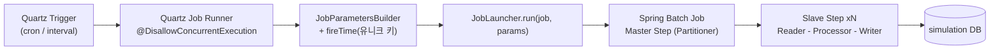

# batch 모듈 — 구성 개요와 배치 설계 원리

`simulation` 프로젝트의 배치 서버 모듈이다. **Quartz(스케줄 엔진) + Spring Batch(실행 엔진)** 두 축으로 동작하며,
동시에 내장 웹 서버(포트 8081)로 API 서버와 통신하는 **내부 REST 엔드포인트**도 제공하는 하이브리드 배치 서버다.

- **엔트리**: `batch/src/main/java/com/hscmt/BatchApplication.java` — `@EnableBatchProcessing` + `@EnableJpaAuditing` + `@EnableCaching`, `DataSourceAutoConfiguration` 제외(수동 DataSource 구성)
- **산출물**: `batch.jar` (`bootJar.archiveFileName`, `jar` 태스크는 비활성)
- **스케줄링**: 100% Quartz. `@Scheduled` / `@EnableScheduling` 은 리포 전체에 **0건**
- **DB**: PostgreSQL(`simulation`, 주 DB) + Tibero(`waternet`, 외부 조회 전용) 2중 DataSource

---

## 문서 인덱스

| 문서 | 패키지 | 다루는 내용 |
|---|---|---|
| [collect.md](collect.md) | `simulation.collect` | 태그 수집 — `tagAutoCollectJob` / `tagManualCollectJob` (파티션 + chunk 2종) |
| [partition.md](partition.md) | `simulation.partition` | 파티션 테이블 생명주기 — `partitionManageJob` (Tasklet + 파티션 chunk 혼합) |
| [program.md](program.md) | `simulation.program` | 프로그램 실행 / 실행이력 정리 — `pgmExecHistCleanupJob` + Quartz 단독 Job |
| [tag.md](tag.md) | `simulation.tag` | 수집대상 태그 정리 — `tagInfoCleanUpJob` (Tasklet 단일) |
| [dataset.md](dataset.md) | `simulation.dataset` | 계측 데이터셋 파일(XLSX/CSV) 생성 — Quartz 단독 Job |
| [schedule.md](schedule.md) | `simulation.schedule` | Quartz 스케줄 reconcile · `BuiltinJobs` 고정 스케줄 정의 |
| [layer.md](layer.md) | `simulation.layer` | SHP(쉐이프파일) → DB 이관 |
| [waternet.md](waternet.md) | `waternet` | 외부 Tibero DB 연계 (계측 원천 데이터 조회) |
| [common.md](common.md) | `simulation.common` · `com.hscmt.common` | 멀티 DataSource · Tx · MyBatis · Quartz 설정, 공통 유틸, JWT/AOP |

---

## 1. 패키지 배치도

```
batch/src/main/java/com/hscmt/
├── BatchApplication.java              부트 엔트리
├── ShutdownOrderGuard.java            종료 순서 제어 (Quartz → batchExecutor)
├── common/                            batch 모듈 내부 공통 (util·comp·web·swagger)
│   ├── comp/QuartzJobManageComp.java  Quartz 조작 핵심
│   ├── util/PartitionerUtil.java      Spring Batch Partitioner 공통 유틸
│   └── util/PartitionCheckUtil.java   DB 파티션 명명/필요여부 계산
├── simulation/
│   ├── collect/                       ★ 태그 수집 (Job 2개)
│   ├── partition/                     ★ DB 파티션 관리 (Job 1개)
│   ├── program/                       ★ 프로그램 실행/이력정리 (Job 1개 + Quartz Job 1개)
│   ├── tag/                           ★ 수집대상 태그 정리 (Job 1개)
│   ├── dataset/                       계측 데이터셋 파일 생성 (Quartz Job 1개)
│   ├── schedule/                      스케줄 reconcile · BuiltinJobs
│   ├── layer/                         SHP → DB 이관
│   ├── common/                        DataSource·Tx·MyBatis·Quartz 설정, JWT
│   └── web/                           수동 Job 제어 컨트롤러
└── waternet/                          2차 DB (Tibero) 연계
```

> ★ = Spring Batch `Job` Bean 을 보유한 패키지.

---

## 2. Job 카탈로그 (Spring Batch Job 5개)

| Job Bean | 정의 위치 | Step 구성 | gridSize | chunk | TaskExecutor | 기동 경로 |
|---|---|---|---|---|---|---|
| `tagAutoCollectJob` | `collect/job/auto/config/TagAutoCollectJobConfig.java:38` | Master(partition) → Slave(chunk) | 4 | 1000 | `batchExecutor` | Quartz cron `50 * * * * ?` |
| `tagManualCollectJob` | `collect/job/manual/config/TagManualCollectJobConfig.java:39` | Master(partition) → Slave(chunk) → Clear(Tasklet) | 4 | 1000 | `batchExecutor` | `CollectTagService` 수동 호출 |
| `partitionManageJob` | `partition/job/config/PartitionTableJobConfig.java:43` | Tasklet ×2 → Master(partition)+Slave(chunk) → Tasklet | 미지정(기본 6) | 1000 | **없음(순차)** | Quartz cron `30 50 23 L * ?` |
| `pgmExecHistCleanupJob` | `program/job/config/ProgramExecHistCleanupJobConfig.java:31` | Master(partition) → Slave(chunk) | 12 | 500 | `batchExecutor` | `POST /pgm/hists-clear` |
| `tagInfoCleanUpJob` | `tag/job/config/TagInfoCleanUpJobConfig.java:27` | Tasklet 단일 | — | — | — | Quartz cron `40 5 0/2 * * ?` |

Spring Batch 를 쓰지 않고 Quartz 만으로 도는 Job 2개도 있다 — `RealtimeProgramExecuteJob`(프로그램 실행), `MeasureDatasetCreatorJob`(데이터셋 파일 생성). 둘 다 `QuartzJobBean` 을 상속하며 서비스 메서드를 직접 호출한다. 자세한 내용은 [program.md](program.md) · [dataset.md](dataset.md) 참조.

---

## 3. 실행 계층 — Quartz 가 Spring Batch 를 깨우는 구조

이 모듈의 핵심 설계는 **스케줄 관리(Quartz)와 대량 처리(Spring Batch)를 분리**한 것이다.
Quartz 는 "언제 돌릴지"만 책임지고, 실제 처리는 `JobLauncher` 를 통해 Spring Batch 에 위임한다.



### 브릿지 역할 클래스 (Quartz Job → Spring Batch Job)

| Runner | 실행 대상 | 전달 JobParameters |
|---|---|---|
| `collect/job/TagAutoCollectJobRunner.java` | `tagAutoCollectJob` | `jobExecutor`, `targetDateTime`(now − 3분, 분 단위 truncate), `fireTime` |
| `partition/job/PartitionTableCheckRunner.java` | `partitionManageJob` | `jobExecutor`, `fireTime` |
| `tag/job/TagInfoCleanUpRunner.java` | `tagInfoCleanUpJob` | `jobExecutor`, `fireTime` |

세 Runner 모두 `@DisallowConcurrentExecution` 이 붙어 있어 **이전 실행이 끝나기 전에는 다음 트리거가 겹쳐 돌지 않는다**.
1분 주기인 `tagAutoCollectJob` 처럼 실행 시간이 주기에 근접할 수 있는 Job 에 필수적인 방어 장치다.

### `fireTime` 파라미터의 역할

Spring Batch 는 **동일한 JobParameters 조합으로 같은 Job 을 재실행할 수 없다**(`JobInstanceAlreadyCompleteException`).
이 프로젝트는 모든 Job 실행 시점에 `fireTime = LocalDateTime.now()` 를 파라미터로 넣어 매번 새로운 `JobInstance` 를 만드는 방식으로 이 제약을 우회한다.

```java
JobParameters parameters = new JobParametersBuilder()
        .addString("jobExecutor", jobExecutor)
        .addJobParameter("targetDateTime",
                LocalDateTime.now().minusMinutes(timeGapMinutes).truncatedTo(ChronoUnit.MINUTES), LocalDateTime.class)
        .addJobParameter("fireTime", LocalDateTime.now(), LocalDateTime.class)   // 유니크 키
        .toJobParameters();
```

트레이드오프: 재실행이 항상 가능해지는 대신 **Spring Batch 의 재시작(restart) 기능을 사용할 수 없다**.
실패한 JobExecution 을 이어서 돌리려면 동일 파라미터로 재실행해야 하는데, `fireTime` 이 매번 달라지므로 항상 처음부터 새로 시작한다.

---

## 4. 파티셔닝 — 대상을 N등분해 병렬 처리

### 4.1 Master / Slave 구조

Spring Batch 의 파티셔닝은 **Master Step 하나가 작업 대상을 N개로 쪼개고, 동일한 Slave Step 을 N번 병렬 실행**하는 방식이다.
이 프로젝트는 `PartitionStepBuilder` 를 그대로 쓴다.

```java
// TagAutoCollectJobConfig.java:45
@Bean(name = "tagAutoCollectMasterStep")
public Step master() {
    return new StepBuilder("tagAutoCollectMasterStep", jobRepository)
            .partitioner("tagAutoCollectSlaveStep", partition)   // Partitioner 지정
            .step(slave())                                       // 복제 대상 Slave Step
            .gridSize(4)                                         // 파티션 희망 개수
            .taskExecutor(taskExecutor)                          // 병렬 실행기
            .build();
}
```

**`PartitionHandler` 를 직접 정의한 곳은 없다.** `.taskExecutor(...)` 를 주면 `PartitionStepBuilder` 가 내부적으로
`TaskExecutorPartitionHandler` 를 만들어 붙이고, 주지 않으면 `SyncTaskExecutor` 로 **순차 실행**된다.
`partitionManageJob` 의 `programExecHistCleanupMasterStep` 이 후자에 해당한다 — 파티션은 나누되 하나씩 순서대로 처리한다.

### 4.2 두 가지 분할 전략

이 모듈의 4개 `Partitioner` 는 성격이 명확히 갈린다.

| 전략 | Partitioner | 분할 기준 | ExecutionContext 키 |
|---|---|---|---|
| **목록 균등 분할** | `TagAutoCollectPartition` | DB 조회한 수집대상 태그 목록 | `targetList` (`List<TagCollectDto>`) |
| | `TagManualCollectPartition` | 임시파일(JSONL) 라인 | `targetList` (`List<TagCollectDto>`) |
| | `ProgramExecHistCleanupPartitioner` | 임시파일의 `pgm_id` 목록 | `targetList` (`List<String>`) |
| **물리 파티션 단위 분할** | `ProgramExecHistPartitioner` | PostgreSQL 서브파티션 테이블 1개 = 파티션 1개 | `subPartitionTableName` (`String`) |

앞의 3개는 `PartitionerUtil` 을 공유해 리스트를 인덱스로 슬라이스한다.

```java
// com/hscmt/common/util/PartitionerUtil.java
public static int getActualGridSize(int gridSize, int targetSize) {
    return Math.min(gridSize, targetSize);            // 대상이 적으면 gridSize 를 낮춘다
}
public static int getPartitionSize(int actualGridSize, int targetSize) {
    return (int) Math.ceil((double) targetSize / actualGridSize);
}
public static void splitPartition(Map<String, ExecutionContext> partition,
                                  int gridSize, int partitionSize, List<? extends Object> targetList) {
    for (int i = 0; i < gridSize; i++) {
        int fromIndex = i * partitionSize;
        int toIndex = Math.min(fromIndex + partitionSize, targetList.size());
        ExecutionContext executionContext = new ExecutionContext();
        executionContext.put("targetList", new ArrayList<>(targetList.subList(fromIndex, toIndex)));
        partition.put("partition" + i, executionContext);       // 키: partition0 ~ partitionN
    }
}
```

마지막 하나는 완전히 다른 접근이다. **DB 카탈로그(`pg_inherits`)를 조회해 물리 서브파티션 테이블 이름 자체를 파티션 단위로 삼는다.**
덕분에 각 Slave Step 이 서로 다른 물리 테이블을 스캔하게 되어 lock 경합이 원천적으로 없다.

```java
// partition/job/config/partition/ProgramExecHistPartitioner.java
List<String> subPartitions = jdbcTemplate.query(
        "SELECT c.relname AS child_table FROM pg_inherits i " +
        "JOIN pg_class c ON i.inhrelid = c.oid JOIN pg_class p ON i.inhparent = p.oid " +
        "WHERE p.relname = ?",
        (rs, i) -> rs.getString("child_table"),
        ((RangeHashRule) rule).getDetachPartitionTableName());   // 예: pgm_exec_h_p202501
for (String sub : subPartitions) {
    ExecutionContext ctx = new ExecutionContext();
    ctx.putString("subPartitionTableName", sub);                 // 예: pgm_exec_h_p202501_3
    result.put("partition_" + (idx++), ctx);
}
```

이 Partitioner 는 `gridSize` 인자를 **무시**한다. 파티션 개수 = 서브파티션 테이블 개수(8개)로 고정된다.

### 4.3 Master → Slave 값 전달

파티션마다 다른 값을 넘기는 통로는 `ExecutionContext` 하나뿐이다. Slave 쪽 컴포넌트는 `@StepScope` + SpEL 로 받는다.

```java
@StepScope                                              // 파티션마다 별도 인스턴스 생성
@Component
public class TagAutoCollectItemReader implements ItemReader<TagCollectDto> {
    @Value("#{stepExecutionContext['targetList']}")     // Partitioner 가 심은 값
    private List<TagCollectDto> targetList;
}
```

`@StepScope` 가 없으면 싱글톤 Bean 1개를 4개 파티션이 공유하게 되어 SpEL 주입 자체가 불가능하다.
이 모듈은 Partitioner / Reader / Processor / Writer / Tasklet **전부**를 `@Component + @StepScope` 로 등록하고,
Config 클래스는 이들을 생성자 주입으로 받는다(주입되는 것은 스코프 프록시). `@JobScope` 사용처는 없다.

> **주의점** — `targetList` 를 통째로 `ExecutionContext` 에 넣으면 그 값이 `BATCH_STEP_EXECUTION_CONTEXT` 컬럼에 직렬화되어 저장된다. 태그 수가 크게 늘면 컨텍스트 크기가 문제가 될 수 있는 구조다. ID 범위(from/to)만 넘기고 Slave 가 다시 조회하는 방식이 대안이다.

---

## 5. Chunk — Reader / Processor / Writer 3단 분해

### 5.1 chunk 가 하는 일

`chunk(n, txManager)` 는 "**Reader 로 n건을 모으고 → 각각 Processor 로 변환하고 → Writer 에 n건을 한 번에 넘긴 뒤 → 커밋**"하는 단위를 정의한다.
n건마다 트랜잭션이 끊기므로 100만 건을 처리해도 메모리와 트랜잭션 로그가 일정하게 유지된다.

```java
// TagAutoCollectJobConfig.java:56
@Bean(name = "tagAutoCollectSlaveStep")
public Step slave() {
    return new StepBuilder("tagAutoCollectSlaveStep", jobRepository)
            .<TagCollectDto, MsrmUpsertDto>chunk(1000, transactionManager)   // 입력타입, 출력타입
            .reader(reader)         // TagCollectDto 를 1건씩 공급
            .processor(processor)   // TagCollectDto → MsrmUpsertDto 변환 (null 이면 필터링)
            .writer(writer)         // MsrmUpsertDto 1000건을 Chunk 로 수신
            .build();
}
```

제네릭 두 타입은 각각 **Reader 출력 타입 / Writer 입력 타입**이다. Processor 가 그 사이를 잇는다.
Processor 가 없으면 두 타입이 같아야 한다 — `pgmExecHistCleanupSlaveStep` 의 `<ProgramExecHistDto, ProgramExecHistDto>` 가 그 예다.

### 5.2 이 모듈의 Reader / Processor / Writer 실장

| Job | Reader | Processor | Writer |
|---|---|---|---|
| `tagAutoCollectJob` | 메모리 리스트 iterator | **외부 DB 조회 + 변환 + 필터** | MyBatis upsert |
| `tagManualCollectJob` | 태그별 전량 조회 후 flatten | 순수 변환 | MyBatis upsert (공용) |
| `pgmExecHistCleanupJob` | pgmId 마다 `JdbcCursorItemReader` 재생성 | 없음 | 파일 삭제 + JPA 벌크 delete |
| `partitionManageJob` | 서브파티션 테이블 직접 스캔 | 없음 | 파일 삭제만 |

**표준 Reader 구현체(`JdbcPagingItemReader` · `JpaPagingItemReader` · `MyBatisCursorItemReader`)를 그대로 쓴 곳은 없다.**
전부 커스텀이며, DB 커서가 필요한 두 곳만 `JdbcCursorItemReader` 를 delegate 로 감싸는 방식을 쓴다.

### 5.3 역할 분배의 두 가지 패턴

같은 수집 업무인데 auto 와 manual 의 무게중심이 정반대다. 이 대비가 chunk 설계에서 가장 배울 점이다.

**패턴 A — Processor 가 무거운 쪽 (`tagAutoCollectJob`)**

Reader 는 "어떤 태그를 처리할지" 목록만 흘려보내고, **실제 원천 조회는 Processor 가 1건씩 수행**한다.

```java
// collect/job/auto/step/TagAutoCollectItemProcessor.java
public MsrmUpsertDto process(TagCollectDto item) {
    TagDataDto data = tagService.findTagData(item);   // Tibero 단건 조회
    if (data == null) return null;                    // null 반환 = 필터링 (Writer 로 안 감)
    return new MsrmUpsertDto(data, jobExecutor);
}
```

`ItemProcessor` 가 `null` 을 반환하면 그 아이템은 조용히 버려진다. **필터링을 별도 분기 없이 표현하는 관용구**다.
자동 수집은 "특정 1분의 값 1건"만 필요하므로 태그당 조회량이 작아 이 방식이 자연스럽다.

**패턴 B — Reader 가 무거운 쪽 (`tagManualCollectJob`)**

수동 수집은 기간 조회라 태그 하나가 수천 건을 만든다. 그래서 **Reader 가 태그별로 전량을 조회한 뒤 1건씩 풀어놓고**, Processor 는 형변환만 한다.

```java
// collect/job/manual/step/TagManualCollectItemReader.java
public TagDataDto read() throws Exception {
    while (true) {
        if (currentIter != null && currentIter.hasNext()) return currentIter.next();  // 남은 것부터
        targetIdx++;
        if (targetList == null || targetIdx >= targetList.size()) return null;        // 전부 소진 = Step 종료
        currentIter = tagService.findTagDataList(currentTarget()).iterator();         // 다음 태그 조회
    }
}
```

`ItemReader.read()` 가 `null` 을 반환하면 Step 이 종료된다. 위 while 루프는 "**여러 소스를 하나의 스트림처럼 이어붙이는**" 전형적인 flatten 패턴이다.
`ItemStreamReader` 를 구현해 `open()` 에서 커서 상태를 초기화하는 것도 `@StepScope` 인스턴스의 상태를 매 Step 시작 시 리셋하기 위함이다.

### 5.4 Writer — chunk 단위로 받는다는 것의 의미

```java
// collect/job/step/TagCollectItemWriter.java  (auto/manual 공용)
public void write(Chunk<? extends MsrmUpsertDto> chunk) throws Exception {
    log.info("TagCollectItemWriter write chunk size: {}", chunk.size());
    chunk.forEach(item -> { if (item != null) mapper.upsertTagData(item); });
}
```

겉보기엔 1건씩 호출하는 것 같지만 그렇지 않다. `SqlSessionTemplate` 이 **`ExecutorType.BATCH`** 로 등록되어 있어
(`simulation/common/config/mybatis/SimulationMybatisConfig.java`) JDBC 레벨에서는 1000건이 한 번에 묶여 나간다.

SQL 은 PostgreSQL `ON CONFLICT` upsert 다 — 재수집·중복 수집에도 안전하다(멱등).

```sql
-- resources/sqlmap/mapper/collect/CollectMapper.xml
insert into msrm_l (tag_sn, msrm_dttm, msrm_val, rgst_id, rgst_dttm, mdf_id, mdf_dttm)
values (...) on conflict (tag_sn, msrm_dttm)
do update set mdf_id = excluded.mdf_id, mdf_dttm = excluded.mdf_dttm, msrm_val = excluded.msrm_val
```

Writer 가 항상 DB 를 쓰는 것도 아니다. cleanup 계열 Writer 는 **파일시스템 삭제**가 주 업무이며,
`chunk.getItems()` 를 `Set` 으로 모아 **중복 경로를 한 번만 지우는** 최적화를 한다 — chunk 단위 수신이라 가능한 처리다.

```java
// partition/job/config/partition/ProgramExecHistItemWriter.java
Set<String> paths = chunk.getItems().stream()
        .map(dto -> FileUtil.getDirPath(vcomp.getProgramBasePath(), dto.getPgmId(),
                                        vcomp.getEXEC_RESULT_DIR(), dto.getRsltDirId()))
        .collect(Collectors.toSet());     // 같은 결과 디렉토리 중복 제거
for (String path : paths) FileUtil.retryDelete(path);
```

### 5.5 chunk size 선정

| Step | chunk | 근거 |
|---|---|---|
| `tagAutoCollectSlaveStep` | 1000 | 태그 1건 = 계측값 1행. Writer 가 upsert 배치라 크게 잡아도 부담 적음 |
| `tagManualCollectSlaveStep` | 1000 | 동일 |
| `programExecHistCleanupSlaveStep` | 1000 | 파일 삭제 위주, DB 부하 없음 |
| `pgmExecHistCleanupSlaveStep` | 500 | 항목마다 디렉토리 삭제 + JPA 벌크 delete 동반 → 트랜잭션 시간을 짧게 |

전부 **하드코딩 리터럴**이며 프로퍼티로 외부화되어 있지 않다. 운영 중 튜닝하려면 재빌드가 필요하다.

---

## 6. 실행 인프라

### 스레드풀 — `common/src/main/java/com/hscmt/common/config/AsyncConfig.java`

| Bean | core / max / queue | 거부 정책 | 용도 |
|---|---|---|---|
| `batchExecutor` | 16 / 32 / 1000 | `AbortPolicy` | 파티션 Slave Step 병렬 실행 + `@Async("batchExecutor")` |
| `asyncExecutor` | 8 / 24 / 200 | `CallerRunsPolicy` | 범용 `@Async` |

`ThreadPoolExecutor` 표준 동작상 core(16) 초과 요청은 max 로 늘기 전에 queue(1000)에 쌓이므로 **실질 동시 파티션 수는 16**이다.
현재 최대 gridSize 가 12 라 문제되지 않는다. `throttleLimit` 설정은 리포 전체에 없다.

`batchExecutor` 는 배치 전용이 아니라 `ProgramExecuteAsyncFacade` · `ProgramExecEventHandler` 의 `@Async` 와 **공유**된다는 점에 유의한다.

### 종료 순서 — `ShutdownOrderGuard.java`

`SmartLifecycle` 을 `getPhase() = Integer.MAX_VALUE` 로 구현해 **가장 마지막에 stop** 되도록 한다.
① Quartz `shutdown(true)` 로 실행 중 Job 완료 대기 → ② `batchExecutor` graceful shutdown 순서를 보장한다.
반대 순서로 내려가면 실행 중인 파티션 Step 이 스레드풀 부재로 실패한다.

### DataSource / 트랜잭션

`simulation/common/config/jpa/SimulationJpaConfig.java` 의 `simulationDataSource` 에 `@Primary` + `@BatchDataSource` + `@QuartzDataSource` 가 동시에 붙어 있다.
즉 **Spring Batch 메타테이블(`BATCH_*`)과 Quartz 테이블(`QRTZ_*`)이 업무 DB 와 같은 PostgreSQL 인스턴스에 존재**한다.
모든 Step 의 트랜잭션 매니저는 `simulationTransactionManager`(`JpaTransactionManager`)로 통일되어 있다. 상세는 [common.md](common.md).

### 스키마 초기화

```yaml
# resources/application-common.yml
spring:
  batch:
    jdbc: { initialize-schema: never }    # doc/ddl/23.배치테이블초기화.sql 로 수동 생성
  quartz:
    jdbc: { initialize-schema: never }    # doc/ddl/22.quartz테이블초기화.sql 로 수동 생성
    auto-startup: false                   # QuartzReconciler 가 수동 start
```

### 빌드

```bash
./gradlew :batch:bootJar -Pprofile=dev      # resources-env/dev 가 소스셋에 주입됨
```

`ext.profile` 미지정 시 `common` 이 기본값이며 `src/main/resources-env/{profile}` 이 리소스 소스셋에 더해진다.

---

## 7. 남은 일 / 알려진 개선점

문서화 과정에서 확인한 항목이다. 수정하지 않고 기록만 남긴다.

| 위치 | 내용 |
|---|---|
| `PartitionerUtil.getPartitionSize` | 대상 0건이면 `actualGridSize = 0` → `0/0 = NaN` → 파티션 0개. Partitioner 3종 공통 |
| `ProgramExecHistPartitioner` | 서브파티션 조회 결과가 비면 파티션 0개로 Step 실패 가능. 타입 검증을 `assert` 로 해 `-ea` 없으면 무력화 |
| `ProgramExecHistCleanupItemReader` | `update()` 가 `currentPgmIndex` 를 저장하지 않아 재시작 안전하지 않음(코드 주석에도 명시) |
| `ManualJobTaskController.partitionChk` | `partitionManageJob` 을 실행하면서 `waitForExecutionId("tagManualCollectJob", ...)` 로 다른 Job 을 조회. 게다가 `run()` **이전**에 호출해 항상 3초 대기 후 null |
| `InternalRequestController.deleteJob` | `delete(group.name(), targetId)` — 실제 시그니처는 `delete(targetId, group)`. 인자 순서 뒤바뀜 |
| `common/web/CorsFilter.java` | `request.getHeader(...) == "true"` 문자열 참조 비교 → 항상 false |
| `batch/src/test/.../PartitionJobTest.java` | JUnit 4 API 인데 Gradle 은 `useJUnitPlatform()`, vintage engine 의존 없음 → 실행되지 않음 |
| 공통 | `JobExecutionListener` / `StepExecutionListener` / `SkipPolicy` / `RetryPolicy` 구현체 **0건**. 스킵·재시도 정책 미구성 |
