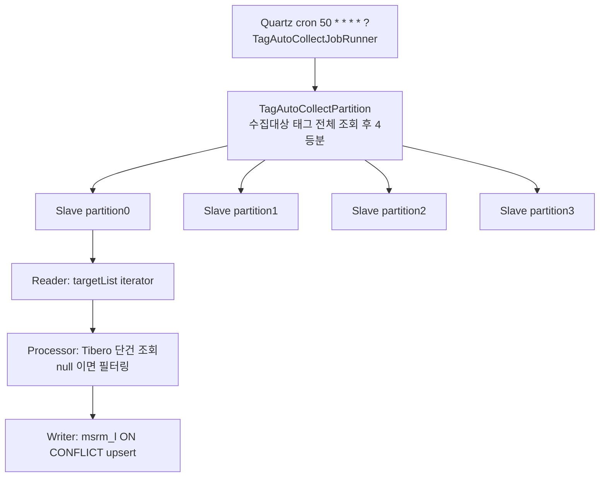
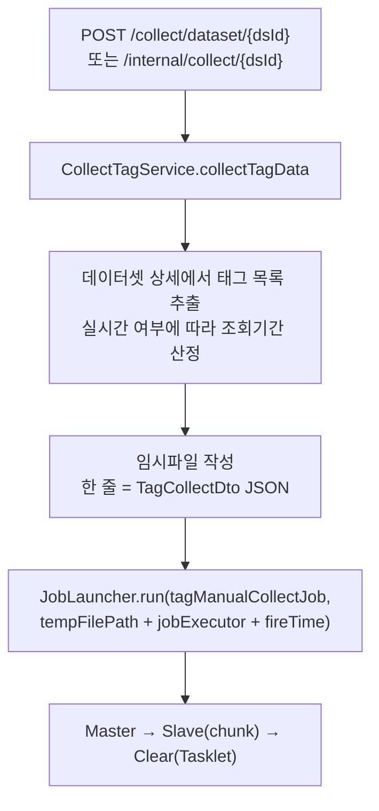

# simulation.collect — 태그 계측값 수집

외부 상수도 관망 DB(`waternet`, Tibero)에서 태그별 계측값을 읽어 자체 DB(`simulation`, PostgreSQL)의
`msrm_l`(계측내역) 테이블에 적재하는 패키지다. **Job 2개를 보유한 이 모듈의 주력 도메인**이다.

- **자동 수집** (`tagAutoCollectJob`) — 매분, 전체 수집대상 태그의 **직전 1분 값 1건**
- **수동 수집** (`tagManualCollectJob`) — 사용자 요청 시, 지정한 태그들의 **지정 기간 전량**

두 Job 은 대상 선정 방식과 조회량이 다르고, 그에 따라 **Reader / Processor 의 역할 분배가 정반대**다.
이 대비가 이 패키지에서 가장 중요한 설계 포인트다.

---

## 1. 패키지 구조

```
simulation/collect/
├── job/
│   ├── TagAutoCollectJobRunner.java          Quartz Job → tagAutoCollectJob 런처
│   ├── auto/
│   │   ├── config/TagAutoCollectJobConfig.java
│   │   └── step/
│   │       ├── TagAutoCollectPartition.java      Partitioner — DB 태그목록 균등 분할
│   │       ├── TagAutoCollectItemReader.java     Reader    — 리스트 iterator
│   │       └── TagAutoCollectItemProcessor.java  Processor — 원천 조회 + 변환 + 필터
│   ├── manual/
│   │   ├── config/TagManualCollectJobConfig.java
│   │   └── step/
│   │       ├── TagManualCollectPartition.java    Partitioner — 임시파일 라인 균등 분할
│   │       ├── TagManualCollectItemReader.java   Reader    — 태그별 전량조회 후 flatten
│   │       ├── TagManualCollectItemProcessor.java Processor — 순수 변환
│   │       └── ClearTempFileTask.java            Tasklet   — 임시파일 삭제
│   └── step/TagCollectItemWriter.java        Writer — auto/manual 공용, MyBatis upsert
├── mapper/CollectMapper.java                 @SimulationMapper — upsertTagData
├── repository/TagCollectRepository.java      QueryDSL — findAllCollectTag
└── service/CollectTagService.java            수동 수집 트리거 (임시파일 작성 + JobLauncher)
```

`job/step/TagCollectItemWriter` 만 `auto` / `manual` 바깥의 공통 위치에 있다 — **두 Job 이 같은 Writer 를 공유**하기 때문이다.
최종 산출물(`MsrmUpsertDto`)과 적재 대상(`msrm_l`)이 동일하므로 쓰기 계층을 나눌 이유가 없다.

---

## 2. `tagAutoCollectJob` — 자동 수집

### 2.1 전체 흐름



### 2.2 Step 구성 — `auto/config/TagAutoCollectJobConfig.java`

| 항목 | 값 |
|---|---|
| Job Bean | `tagAutoCollectJob` (:38) |
| Master Step | `tagAutoCollectMasterStep` — `gridSize(4)`, `taskExecutor(batchExecutor)` (:45) |
| Slave Step | `tagAutoCollectSlaveStep` — `chunk(1000)`, `<TagCollectDto, MsrmUpsertDto>` (:56) |
| TxManager | `simulationTransactionManager` |

```java
@Bean(name = "tagAutoCollectJob")
public Job tagAutoCollectJob() {
    return new JobBuilder("tagAutoCollectJob", jobRepository)
            .start(master())      // Master 하나로 끝. 후처리 Step 없음
            .build();
}
```

### 2.3 JobParameters — `job/TagAutoCollectJobRunner.java`

Quartz `JobDataMap` 에서 값을 꺼내 Spring Batch 파라미터로 변환한다.

| 파라미터 | 값 | 사용처 |
|---|---|---|
| `jobExecutor` | `"AUTO_TAG_COLLECT"` (JobDataMap) | `TagAutoCollectItemProcessor` — 등록/수정자 ID |
| `targetDateTime` | `now() − timeGapMinutes(3분)`, 분 단위 truncate | `TagAutoCollectPartition` — 조회 대상 시각 |
| `fireTime` | `LocalDateTime.now()` | JobInstance 유니크 키 (실제 로직에서 미사용) |

**`timeGapMinutes = 3` 의 의미** — 원천 시스템이 계측값을 적재하는 데 지연이 있으므로 현재 시각이 아니라 3분 전 값을 가져온다.
값은 `BuiltinJobs.AUTO_TAG_COLLECT` 의 `jobData` 에 선언되어 있다([schedule.md](schedule.md) 참조).

### 2.4 Partitioner — 대상 태그 목록 4등분

```java
// auto/step/TagAutoCollectPartition.java
@Value("#{jobParameters['targetDateTime']}")
private LocalDateTime targetDateTime;

public Map<String, ExecutionContext> partition(int gridSize) {
    String targetLogTime = formatter.format(targetDateTime);           // yyyyMMddHHmm
    List<WaternetTagDto> tags = collectRepository.findAllCollectTag(null);   // use_yn = 'Y' 전체
    log.info("수집대상 태그 갯수 : {}", tags.size());

    List<TagCollectDto> targets = tags.stream().map(t -> {
        TagCollectDto dto = new TagCollectDto();
        dto.setTagsn(t.getTagSn());
        dto.setTagSeCd(t.getTagSeCd());
        dto.setTargetLogTime(targetLogTime);      // 모든 파티션이 동일 시각을 공유
        return dto;
    }).toList();

    int actualGridSize = PartitionerUtil.getActualGridSize(gridSize, targets.size());
    int partitionSize  = PartitionerUtil.getPartitionSize(actualGridSize, targets.size());
    PartitionerUtil.splitPartition(partitions, actualGridSize, partitionSize, targets);
    return partitions;
}
```

핵심은 **분할 축이 "시간"이 아니라 "태그"** 라는 점이다. 모든 파티션이 같은 `targetLogTime` 을 갖고 태그 집합만 다르다.
자동 수집은 시각이 1개로 고정되어 있으므로 시간축으로는 나눌 수가 없다.

대상 조회는 QueryDSL 이며 조건은 `use_yn = 'Y'` 하나다 — 이 플래그를 관리하는 것이 [tag.md](tag.md) 의 `tagInfoCleanUpJob` 이다.

```java
// repository/TagCollectRepository.java
builder.and(qWaternetTag.useYn.eq(YesOrNo.Y));
```

### 2.5 Reader — 순수 iterator

```java
// auto/step/TagAutoCollectItemReader.java
@StepScope @Component
public class TagAutoCollectItemReader implements ItemReader<TagCollectDto> {
    private Iterator<TagCollectDto> iterator;
    @Value("#{stepExecutionContext['targetList']}")
    private List<TagCollectDto> targetList;

    public TagCollectDto read() {
        if (iterator == null) iterator = targetList.iterator();
        return iterator.hasNext() ? iterator.next() : null;   // null = Step 종료
    }
}
```

DB 접근이 전혀 없다. Partitioner 가 이미 대상을 다 만들어 넘겼기 때문에 **Reader 는 "꺼내주는 역할"만** 한다.
`ItemStream` 을 구현하지 않아 재시작 시 처음부터 다시 읽는다.

### 2.6 Processor — 이 Job 의 무게중심

```java
// auto/step/TagAutoCollectItemProcessor.java
@Value("#{jobParameters['jobExecutor']}")
private String jobExecutor;

public MsrmUpsertDto process(TagCollectDto item) {
    TagDataDto data = tagService.findTagData(item);   // Tibero 단건 조회
    if (data == null) return null;                    // 필터링 — Writer 로 전달되지 않음
    return new MsrmUpsertDto(data, jobExecutor);
}
```

실제 원천 조회가 여기서 일어난다. `tagService.findTagData()` 는 `tagSeCd` 에 따라 시자료/분자료 테이블을 갈라 조회한다([waternet.md](waternet.md)).

**`null` 반환의 의미** — Spring Batch 는 `ItemProcessor` 가 `null` 을 돌려주면 그 아이템을 chunk 에서 제외한다.
"해당 시각에 값이 없는 태그"를 별도 예외나 분기 없이 자연스럽게 걸러내는 관용구다. 필터링된 건수는 `StepExecution.filterCount` 에 집계된다.

> 태그 수만큼 단건 쿼리가 나가는 구조라, 태그가 크게 늘면 여기가 병목이 된다. gridSize 를 올려 병렬도를 높이거나 `IN` 절 일괄 조회로 바꾸는 것이 개선 방향이다.

---

## 3. `tagManualCollectJob` — 수동 수집

### 3.1 트리거 — `service/CollectTagService.java`

사용자가 데이터셋 재수집을 요청하면 이 서비스가 **임시파일(JSONL)을 만들고** Job 을 띄운다.



조회 기간 산정 로직:

| 데이터셋 유형 | 시작 | 종료 |
|---|---|---|
| 실시간 (`rltmYn = Y`) | `end − inqyTerm × termTypeCd 단위` | `now()` 분 단위 truncate |
| 고정 | `strtDttm` (데이터셋 정의값) | `endDttm` |

```java
tempFilePath = Files.createTempFile(UuidCreator.getTimeOrderedEpoch() + "_" + "tags", ".txt");
try (BufferedWriter writer = Files.newBufferedWriter(tempFilePath, UTF_8, CREATE, TRUNCATE_EXISTING)) {
    for (TagCollectDto dto : tagCollectDtos) {
        writer.write(om.writeValueAsString(dto));   // 한 줄 = 한 태그의 수집 지시
        writer.newLine();
    }
}
```

**왜 임시파일인가** — 대상 목록을 JobParameters 로 직접 넘길 수 없기 때문이다.
JobParameters 는 `BATCH_JOB_EXECUTION_PARAMS` 테이블에 저장되는 짧은 스칼라 값 전용이며, 수백~수천 건의 리스트를 담기에 적합하지 않다.
파일 경로 문자열 하나만 파라미터로 넘기고 실제 목록은 파일에 두는 것이 이 모듈의 해법이다.
같은 패턴을 [program.md](program.md) 의 `pgmExecHistCleanupJob` 도 사용한다.

### 3.2 Step 구성 — `manual/config/TagManualCollectJobConfig.java`

```java
@Bean(name = "tagManualCollectJob")
public Job tagManualCollectJob() {
    return new JobBuilder("tagManualCollectJob", jobRepository)
            .start(master())    // 파티션 수집
            .next(clear())      // 임시파일 삭제 (Tasklet)
            .build();
}
```

| 항목 | 값 |
|---|---|
| Master Step | `tagManualCollectMasterStep` — `gridSize(4)`, `taskExecutor(batchExecutor)` (:47) |
| Slave Step | `tagManualCollectSlaveStep` — `chunk(1000)`, `<TagDataDto, MsrmUpsertDto>` (:57) |
| 후처리 Step | `tagManualCollectClearStep` — `ClearTempFileTask` Tasklet (:67) |

auto 와 달리 **Step 2개를 `.next()` 로 직렬 연결**한다. 파티션 수집이 전부 성공해야 임시파일이 지워지므로,
실패 시 임시파일이 남아 원인 추적이 가능하다.

```java
// manual/step/ClearTempFileTask.java
public RepeatStatus execute(StepContribution contribution, ChunkContext chunkContext) {
    if (tempFilePath == null || tempFilePath.isBlank()) {
        log.warn("tempFilePath is null or blank. skip clear");
        return RepeatStatus.FINISHED;
    }
    Path path = Paths.get(tempFilePath);
    if (Files.exists(path)) Files.deleteIfExists(path);
    return RepeatStatus.FINISHED;    // FINISHED = 1회 실행 후 Step 종료
}
```

`Tasklet` 은 chunk 개념이 없는 **단발성 Step** 이다. `RepeatStatus.FINISHED` 를 돌려주면 끝나고,
`RepeatStatus.CONTINUABLE` 을 돌려주면 같은 Tasklet 이 반복 호출된다(여기서는 사용하지 않음).

### 3.3 Partitioner — 임시파일 라인 균등 분할

```java
// manual/step/TagManualCollectPartition.java
@Value("#{jobParameters['tempFilePath']}")
private String tempFilePath;

private List<TagCollectDto> getTagCollectInfo() {
    try (Stream<String> lines = Files.lines(Paths.get(tempFilePath), StandardCharsets.UTF_8)) {
        return lines.filter(s -> !s.isBlank())
                    .map(s -> om.readValue(s, TagCollectDto.class))
                    .collect(Collectors.toList());
    }
}
```

읽어온 목록을 `PartitionerUtil` 로 4등분하는 것은 auto 와 동일하다. **차이는 대상의 출처(DB vs 파일)뿐**이다.

### 3.4 Reader — 태그별 전량 조회 후 flatten

```java
// manual/step/TagManualCollectItemReader.java
@StepScope @Component
public class TagManualCollectItemReader implements ItemStreamReader<TagDataDto> {
    @Value("#{stepExecutionContext['targetList']}")
    private List<TagCollectDto> targetList;

    private int targetIdx = -1;
    private Iterator<TagDataDto> currentIter;

    public TagDataDto read() throws Exception {
        while (true) {
            if (currentIter != null && currentIter.hasNext()) return currentIter.next();
            targetIdx++;
            if (targetList == null || targetIdx >= targetList.size()) return null;   // 전부 소진
            currentIter = tagService.findTagDataList(currentTarget()).iterator();     // 다음 태그 전량 조회
        }
    }

    public void open(ExecutionContext executionContext) {   // Step 시작 시 커서 초기화
        targetIdx = -1;
        currentIter = null;
    }
}
```

**auto 와의 결정적 차이** — 수동 수집은 기간 조회라 태그 1건이 수천 행을 만든다.
Processor 에서 1건씩 조회하면 chunk 단위와 실제 데이터 단위가 어긋나므로, Reader 가 **"태그 목록"을 "계측값 스트림"으로 평탄화**한다.
`ItemStreamReader` 를 구현해 `open()` 에서 상태를 리셋하는 것은 `@StepScope` 인스턴스가 Step 시작 시 항상 초기 상태여야 하기 때문이다.

### 3.5 Processor — 순수 변환

```java
// manual/step/TagManualCollectItemProcessor.java
public MsrmUpsertDto process(TagDataDto item) throws Exception {
    if (item == null) return null;
    return new MsrmUpsertDto(item, jobExecutor);
}
```

조회가 Reader 로 옮겨갔으므로 Processor 에는 형변환만 남았다.

---

## 4. Writer — auto / manual 공용

```java
// job/step/TagCollectItemWriter.java
@StepScope @Component
public class TagCollectItemWriter implements ItemWriter<MsrmUpsertDto> {
    private final CollectMapper mapper;

    public void write(Chunk<? extends MsrmUpsertDto> chunk) throws Exception {
        log.info("TagCollectItemWriter write chunk size: {}", chunk.size());
        chunk.forEach(item -> { if (item != null) mapper.upsertTagData(item); });
    }
}
```

- `SqlSessionTemplate` 이 `ExecutorType.BATCH` 이므로 반복 호출이 **JDBC 배치로 묶여** 나간다
- SQL 은 `ON CONFLICT (tag_sn, msrm_dttm) DO UPDATE` — 같은 구간을 두 번 수집해도 중복 행이 생기지 않는다(멱등)

```sql
-- resources/sqlmap/mapper/collect/CollectMapper.xml
insert into msrm_l (tag_sn, msrm_dttm, msrm_val, rgst_id, rgst_dttm, mdf_id, mdf_dttm)
values (#{tagSn}, #{msrmDttm}, #{msrmVal}, #{rgstId}, #{rgstDttm}, #{mdfId}, #{mdfDttm})
on conflict (tag_sn, msrm_dttm)
do update set mdf_id = excluded.mdf_id, mdf_dttm = excluded.mdf_dttm, msrm_val = excluded.msrm_val
```

적재 대상 `msrm_l` 은 **RANGE(`msrm_dttm`, 월) + HASH(`tag_sn`, 8) 복합 파티션 테이블**이다(`doc/ddl/21.계측내역.sql`).
파티션이 미리 생성되어 있지 않으면 insert 가 실패하므로, [partition.md](partition.md) 의 `partitionManageJob` 이 선행 조건이다.

---

## 5. 두 Job 비교 요약

| 항목 | `tagAutoCollectJob` | `tagManualCollectJob` |
|---|---|---|
| 트리거 | Quartz cron `50 * * * * ?` | 사용자 요청 (`CollectTagService`) |
| 대상 출처 | DB (`wnet_tag.use_yn = 'Y'` 전체) | 임시파일 JSONL |
| 조회 범위 | 특정 1분, 태그당 1건 | 지정 기간, 태그당 N건 |
| Reader | 리스트 iterator (DB 접근 없음) | 태그별 전량 조회 + flatten |
| Processor | **원천 조회 + 변환 + 필터** | 변환만 |
| Reader 출력 타입 | `TagCollectDto` (수집 지시) | `TagDataDto` (계측값) |
| 후처리 Step | 없음 | 임시파일 삭제 Tasklet |
| Writer | `TagCollectItemWriter` (공용) | 동일 |

**설계 교훈** — chunk 의 "1 item" 을 무엇으로 잡느냐가 Reader/Processor 역할 분배를 결정한다.
1 item 이 "수집 지시"면 조회가 Processor 로 가고, 1 item 이 "계측값"이면 조회가 Reader 로 간다.
chunk size(1000)가 의미를 가지려면 **1 item 이 최종 적재 행 1건과 일치**해야 하므로, 대량 조회 Job 은 후자를 택하는 것이 옳다.

---

## 6. 관련 문서

- [README.md](README.md) — 파티셔닝 · chunk 총론
- [tag.md](tag.md) — `wnet_tag.use_yn` 을 관리하는 `tagInfoCleanUpJob`
- [waternet.md](waternet.md) — `TagService.findTagData` / `findTagDataList` 원천 조회
- [partition.md](partition.md) — `msrm_l` 파티션 생성·삭제
- [schedule.md](schedule.md) — `BuiltinJobs.AUTO_TAG_COLLECT` cron · jobData 정의
