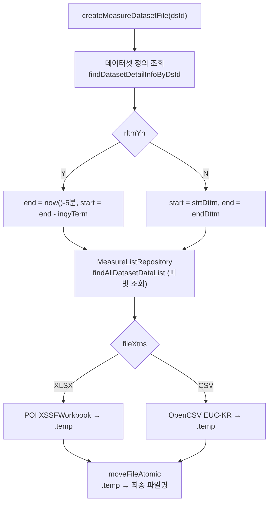

# simulation.dataset — 계측 데이터셋 파일 생성

수집된 계측값(`msrm_l`)을 데이터셋 정의에 따라 조회·피벗하여 **XLSX 또는 CSV 파일로 떨어뜨리는** 패키지다.
생성된 파일은 시뮬레이션 프로그램의 입력 파일로 쓰인다([program.md](program.md) 의 `setUpProgramInputFiles`).

**Spring Batch Job 이 없다.** Quartz Job 하나가 서비스 메서드를 직접 호출하는 구조다.

---

## 1. 패키지 구조

```
simulation/dataset/
├── job/MeasureDatasetCreatorJob.java         Quartz QuartzJobBean
├── service/MeasureDatasetService.java        조회 → 피벗 → 파일 생성
└── repository/
    ├── MeasureDatasetRepository.java             데이터셋 정의 (JPA)
    ├── MeasureDatasetCustomRepository(+Impl)     QueryDSL 커스텀 조회
    ├── MeasureListRepository.java                계측값 조회 + 피벗 (QueryDSL)
    ├── WaternetTagRepository.java                태그 마스터 (JPA)
    └── WaternetTagCustomRepository(+Impl)
```

---

## 2. 왜 Spring Batch 가 아닌가

| 판단 항목 | 이 작업의 성격 |
|---|---|
| 처리 대상 | 데이터셋 **1건** (파일 1개) |
| 중간 커밋 | 불필요 — 읽기 전용 조회 후 파일 쓰기 |
| 부분 실패 격리 | 무의미 — 파일은 전부 만들어지거나 아무것도 안 만들어져야 함 |
| 진행률 추적 | 불필요 |

chunk 는 "대량 아이템을 나눠 커밋"하기 위한 장치인데, 여기에는 나눠 커밋할 것이 없다.
**조회는 한 번에, 파일 쓰기는 원자적으로** 끝나야 하므로 Spring Batch 를 얹으면 오버헤드만 늘어난다.

같은 이유로 [tag.md](tag.md) 의 `tagInfoCleanUpJob` 은 Tasklet 을, 이 패키지는 Quartz 단독을 택했다.
"Spring Batch 를 쓸 것인가"의 판단선이 이 모듈 안에 일관되게 존재한다.

---

## 3. Quartz Job — `job/MeasureDatasetCreatorJob.java`

```java
@Component @DisallowConcurrentExecution
public class MeasureDatasetCreatorJob extends QuartzJobBean {
    @Override
    protected void executeInternal(JobExecutionContext context) throws JobExecutionException {
        String id = context.getMergedJobDataMap().getString("id");   // dsId
        try {
            measureDatasetService.createMeasureDatasetFile(id);
        } catch (Exception e) {
            JobExecutionException ex = new JobExecutionException(e);
            ex.setRefireImmediately(false);
            throw ex;
        }
    }
}
```

`RealtimeProgramExecuteJob` 과 완전히 같은 형태다 — `JobDataMap["id"]` 로 대상을 받고 서비스에 위임한다.

### 등록되는 두 가지 방식

`SchedulerManagedService` 가 데이터셋 성격에 따라 다르게 등록한다([schedule.md](schedule.md)).

| 구분 | 그룹 | 트리거 | 설명 |
|---|---|---|---|
| 실시간 데이터셋 (`rltmYn = Y`) | `DATASET` | `CalendarIntervalSchedule` | 주기 반복. `termTypeCd` 단위 × interval |
| 고정 데이터셋 (`rltmYn = N`) | `TEMP` | `SimpleSchedule().withRepeatCount(0)` + `startNow()` | **서버 기동 시 1회만** 실행 |

고정 데이터셋은 조회 기간이 고정이라 결과가 변하지 않으므로 반복 실행할 필요가 없다.
`storeDurably(false)` + `repeatCount(0)` 로 등록해 **실행 후 Quartz 메타에서 자동 제거**되도록 한다.
JobKey 에 `temp:` prefix 와 UUID 를 붙여 매 기동마다 충돌 없이 새로 등록된다.

---

## 4. 파일 생성 파이프라인 — `service/MeasureDatasetService.java`



### 4.1 조회 기간 산정

```java
if (target.getRltmYn() == YesOrNo.Y) {
    searchEndDttm   = LocalDateTime.now().truncatedTo(ChronoUnit.MINUTES).minus(5, ChronoUnit.MINUTES);
    searchStartDttm = searchEndDttm.minus(target.getInqyTerm(), target.getTermTypeCd().getUnit());
} else {
    searchStartDttm = target.getStrtDttm();
    searchEndDttm   = target.getEndDttm();
}
```

**5분 마진**의 이유 — 자동 수집(`tagAutoCollectJob`)이 `now − 3분` 값을 매분 적재하므로,
그보다 여유를 두지 않으면 아직 수집되지 않은 구간을 조회해 빈 값이 섞인다([collect.md](collect.md)).

### 4.2 피벗 조회 — `repository/MeasureListRepository.java`

`msrm_l` 은 `(tag_sn, msrm_dttm, msrm_val)` 세로 구조인데, 파일은 **행=시각 / 열=태그**의 가로 구조여야 한다.
QueryDSL 로 태그마다 `CASE WHEN ... THEN msrm_val END` 의 `MAX()` 를 만들어 동적 피벗한다.

```java
private List<Expression<?>> getMeasureExpressions(Set<String> tagSns) {
    List<Expression<?>> expressions = new ArrayList<>();
    expressions.add(qMeasureList.id.msrmDttm);
    for (String tagSn : tagSns) {
        NumberExpression<BigDecimal> expr = new CaseBuilder()
                .when(qMeasureList.id.tagSn.eq(tagSn))
                .then(qMeasureList.msrmVal)
                .otherwise((BigDecimal) null);
        expressions.add(expr.max().as("id_" + tagSn));    // 태그 하나 = 컬럼 하나
    }
    return expressions;
}
```

```java
queryFactory.select(getMeasureExpressions(tagSns).toArray(new Expression[0]))
        .from(qMeasureList)
        .where(qMeasureList.id.tagSn.in(tagSns)
                .and(qMeasureList.id.msrmDttm.goe(startDateTime))
                .and(qMeasureList.id.msrmDttm.loe(endDateTime)))
        .groupBy(qMeasureList.id.msrmDttm)
        .orderBy(qMeasureList.id.msrmDttm.asc())
        .fetch();
```

**시각 채우기** — DB 결과에는 계측값이 없는 시각이 아예 빠져 있다.
`DateTimeUtil.getDateTimeList(start, end, MINUTES)` 로 전 구간의 분 단위 시각을 생성한 뒤,
DB 결과를 `Map` 으로 인덱싱해 매칭시킨다. 없는 시각은 모든 태그 값을 `null` 로 채운다.
덕분에 **파일에 시각 누락 행이 생기지 않는다** — 시계열 입력을 기대하는 파이썬 프로그램에 중요하다.

> `msrm_dttm` 범위 조건이 `msrm_l` 의 RANGE 파티션 키와 일치하므로 파티션 프루닝이 걸린다([partition.md](partition.md)).
> 다만 `tag_sn` 이 `IN` 이라 HASH 서브파티션 프루닝은 제한적이다.

### 4.3 파일 쓰기와 원자적 교체

XLSX 는 POI `XSSFWorkbook`, CSV 는 OpenCSV + **EUC-KR** 인코딩(엑셀 한글 호환)을 쓴다.
공통적으로 **`.temp` 확장자로 먼저 쓴 뒤 최종 이름으로 이동**한다.

```java
String orgFilePath  = FileUtil.getFilePath(fileName + ".xlsx", dirPath);
String tempFilePath = orgFilePath + ".temp";
// ... tempFilePath 에 기록 ...
moveFileAtomic(tempFilePath, orgFilePath);
```

파일 생성 도중 프로그램이 그 파일을 읽어가면 **잘린 파일을 입력으로 쓰게 된다**.
쓰기를 임시 이름으로 하고 완료 후 rename 하면, 소비자 입장에서 파일은 항상 "없거나 완전한" 두 상태만 갖는다.

> 헤더 순서를 `HashSet` → `ArrayList` 로 만들어 **태그 열 순서가 실행마다 달라질 수 있다**. `LinkedHashSet` 또는 명시적 정렬이 필요한 지점이다.

---

## 5. 진입점

| 경로 | 호출 | 비고 |
|---|---|---|
| Quartz `DATASET` 그룹 트리거 | `MeasureDatasetCreatorJob` | 실시간 데이터셋 주기 실행 |
| Quartz `TEMP` 그룹 1회성 트리거 | 동일 | 서버 기동 시 고정 데이터셋 |
| `POST /internal/dataset/{dsId}` | `MeasureDatasetService` 직접 | API 서버 내부 호출 (`InternalRequestController`) |

계측값 자체를 다시 수집하려면 파일 생성이 아니라 `POST /internal/collect/{dsId}` — `CollectTagService` 경로다([collect.md](collect.md)).

---

## 6. 관련 문서

- [collect.md](collect.md) — `msrm_l` 을 채우는 수집 Job, 그리고 수동 재수집 트리거
- [schedule.md](schedule.md) — 실시간/고정 데이터셋 Job 등록 전략
- [program.md](program.md) — 생성된 데이터셋 파일을 입력으로 소비하는 쪽
- [partition.md](partition.md) — `msrm_l` 파티션 구조
- `doc/ddl/03.계측데이터셋.sql` · `doc/ddl/04.계측데이터셋상세.sql`
