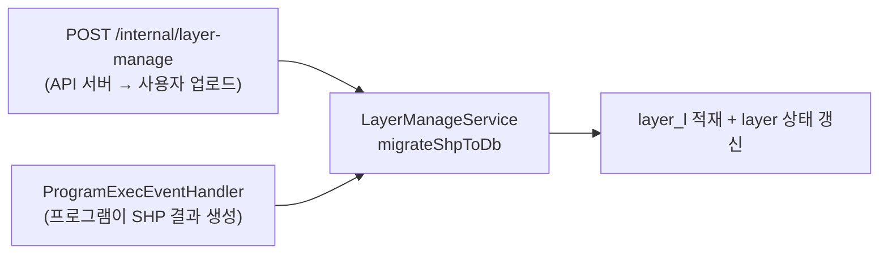
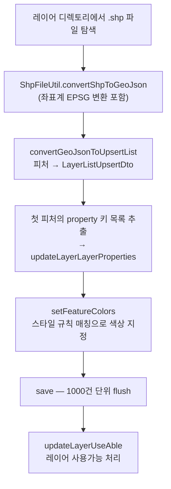

# simulation.layer — 쉐이프파일(SHP) → DB 이관

GIS 쉐이프파일을 읽어 GeoJSON 으로 변환하고, 피처 하나하나를 `layer_l`(레이어내역) 테이블에 적재하는 패키지다.
스타일 규칙에 따라 **피처별 색상까지 계산해 저장**한다.

**Job 이 없다.** 스케줄 실행이 아니라 **요청 기반 동기 처리**이며, 배치 성격의 대량 쓰기는
Spring Batch 가 아니라 **MyBatis `ExecutorType.BATCH` + 수동 flush** 로 처리한다.

---

## 1. 패키지 구조

```
simulation/layer/
├── service/LayerManageService.java     SHP 읽기 → GeoJSON → 색상 계산 → DB 저장 (381줄)
├── mapper/LayerMapper.java             @SimulationMapper — upsert / 상태 갱신
└── repository/LayerRepository.java     QueryDSL — 레이어 단건 조회
```

SQL 은 `resources/sqlmap/mapper/layer/LayerMapper.xml` 에 있다.

---

## 2. 호출 경로

두 방향에서 들어온다.



두 번째 경로가 이 패키지가 존재하는 이유다. 파이썬 시뮬레이션 프로그램이 SHP 를 결과로 뱉으면,
**성공 이벤트 후처리에서 자동으로 레이어를 재생성**한다([program.md](program.md)).

```java
// program/event/ProgramExecEventHandler.java
Layer findLayer = layerRepository.findLayer(layerId);
if (findLayer != null) {
    layerManageService.migrateShpToDb(new LayerUpsertRequest(
            findLayer.getLayerId(), findLayer.getCrsyTypeCd(), findLayer.getLayerStyles(), findLayer.getMdfId()));
}
```

기존 레이어의 좌표계·스타일 설정을 그대로 재사용하므로, **프로그램을 다시 돌리면 지도가 자동 갱신**된다.

---

## 3. 처리 흐름 — `service/LayerManageService.migrateShpToDb`



### 3.1 좌표계 변환

```java
CrsyType crsyType = request.crsyType();
JSONObject geojson = ShpFileUtil.convertShpToGeoJson(shpFile.getAbsolutePath(), crsyType.getEpsgName());
```

`CrsyType` enum 이 EPSG 코드명을 들고 있다. 국내 GIS 데이터는 중부원점(EPSG:5186 등)이 흔한데,
웹 지도 표출에는 WGS84 가 필요하므로 이관 시점에 변환한다.

### 3.2 속성 키 목록 저장

```java
Map<String, Object> propertyMap = om.readValue(dto.getProperty(), new TypeReference<>() {});
List<String> propertyKeyList = new ArrayList<>();
propertyMap.forEach((k, v) -> propertyKeyList.add(k));
mapper.updateLayerLayerProperties(layerId, om.writeValueAsString(propertyKeyList));
```

**첫 번째 피처의 속성 키**를 레이어 메타에 저장한다. 프론트엔드가 "이 레이어로 스타일 조건을 걸 수 있는 필드"를
목록으로 보여주기 위한 용도다. SHP 는 모든 피처가 같은 스키마를 가지므로 첫 건만 봐도 충분하다.

### 3.3 스타일 매칭 — 이 패키지에서 가장 복잡한 부분

`setFeatureColors` 는 피처의 속성값을 스타일 조건과 대조해 색상을 지정한다.
조건 타입(`ConditionType`)에 따라 단일값 매칭과 범위(RANGE) 매칭을 나눠 처리한다.

| 메서드 | 역할 |
|---|---|
| `matchUnified` | 조건 타입 판별 후 단일/범위 매칭으로 분기 |
| `matchSingle` | 등호·부등호 등 단일 조건 비교 |
| `matchRange` | 하한/상한 범위 비교 |
| `parsePriority` · `specificityWeight` · `minValueForSort` | **규칙 정렬** — 우선순위 → 구체성 → 최소값 순 |
| `toNumber` · `isNullLike` | 문자열 속성값의 안전한 숫자 변환 / null 판정 |

정렬 로직이 별도로 있는 이유는 **여러 규칙이 한 피처에 동시에 걸릴 수 있기** 때문이다.
명시적 우선순위가 같으면 **더 구체적인 조건**(범위가 좁은 쪽)이 이긴다.

### 3.4 대량 저장 — 수동 flush 로 메모리 제어

```java
public void save(List<LayerListUpsertDto> upsertList) {
    if (upsertList == null || upsertList.isEmpty()) return;
    LayerMapper mapper = sessionTemplate.getMapper(LayerMapper.class);
    long count = 0;

    for (LayerListUpsertDto dto : upsertList) {
        mapper.upsertLayerList(dto);
        count++;
        if (count % 1000 == 0) {
            sessionTemplate.flushStatements();   // JDBC 배치 전송
            sessionTemplate.clearCache();        // 1차 캐시 비우기
        }
    }
    if (count % 1000 != 0) {                     // 나머지 처리
        sessionTemplate.flushStatements();
        sessionTemplate.clearCache();
    }
}
```

**Spring Batch chunk 와 같은 일을 손으로 한 것**이다.

| | Spring Batch chunk | 여기 |
|---|---|---|
| 배치 크기 | `chunk(1000, txManager)` | `count % 1000` |
| 전송 | Writer 종료 시 자동 flush | `flushStatements()` 명시 호출 |
| 메모리 | chunk 마다 컨텍스트 정리 | `clearCache()` 명시 호출 |
| 트랜잭션 | chunk 단위 커밋 | 바깥 트랜잭션 하나 |

`SqlSessionTemplate` 이 `ExecutorType.BATCH` 라 statement 가 쌓이기만 하고 전송되지 않는다([common.md](common.md)).
`flushStatements()` 를 주기적으로 호출하지 않으면 **피처 수만큼 statement 가 메모리에 누적**된다.
`clearCache()` 는 MyBatis 1차 캐시를 비워 같은 문제를 막는다.

> 트랜잭션은 나뉘지 않으므로 **전부 성공 또는 전부 롤백**이다. 레이어는 부분 적재가 무의미하므로(피처 절반만 있는 지도) 이 선택이 맞다. 대신 대용량 SHP 에서는 트랜잭션 보유 시간이 길어진다.

### 3.5 마무리

```java
mapper.updateLayerUseAble(layerId, executorId, featureType);
```

적재가 끝나야 레이어를 "사용 가능" 상태로 바꾼다. 이관 중인 레이어가 지도에 반쯤 그려지는 것을 막는 플래그다.
[dataset.md](dataset.md) 의 `.temp` → rename 패턴과 같은 발상 — **완성 전에는 소비자에게 노출하지 않는다.**

---

## 4. 왜 Spring Batch 를 쓰지 않았나

| 판단 항목 | 이 작업의 성격 |
|---|---|
| 트리거 | 스케줄이 아니라 **요청 기반**(업로드 / 프로그램 완료 이벤트) |
| 응답 | 호출자가 결과를 기다림 (`/internal/layer-manage` 는 동기) |
| 재시작 | 불필요 — 실패 시 SHP 를 다시 이관하면 됨 |
| 부분 커밋 | **원치 않음** — 레이어는 전부 또는 전무 |

Spring Batch 의 강점(재시작·부분 커밋·진행률)이 모두 필요 없거나 오히려 방해가 되는 케이스다.
필요한 것은 **JDBC 배치 전송으로 인한 속도**뿐이었고, 그건 MyBatis BATCH 모드로 충분하다.

이 모듈은 작업 성격에 따라 세 가지 선택지를 골라 쓴다.

| 선택 | 조건 | 예 |
|---|---|---|
| Spring Batch 파티션 + chunk | 스케줄 · 대량 · 병렬 · 부분 커밋 | `tagAutoCollectJob` |
| Spring Batch Tasklet | 스케줄 · 집합 연산 한 방 | `tagInfoCleanUpJob` |
| **평범한 서비스 + 수동 flush** | 요청 기반 · 원자적 처리 | **`LayerManageService`** |

---

## 5. 관련 문서

- [program.md](program.md) — SHP 결과 파일 발생 시 자동 재생성 트리거
- [schedule.md](schedule.md) — `POST /internal/layer-manage` 엔드포인트
- [common.md](common.md) — `SqlSessionTemplate` `ExecutorType.BATCH` 설정
- `doc/ddl/13.레이어.sql` · `doc/ddl/14.레이어내역.sql`
