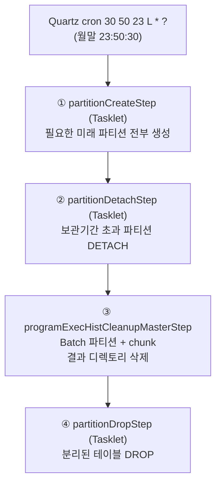

# simulation.partition — DB 파티션 테이블 생명주기 관리

PostgreSQL 파티션 테이블의 **생성 → 분리(detach) → 부속자원 정리 → 삭제(drop)** 전 과정을 자동화하는 패키지다.
batch 모듈에서 클래스 수가 가장 많은 서브도메인이며, **규칙(rule) / 명세(spec) / 실행(job) 을 3층으로 분리한 설계**가 특징이다.

여기서 "파티션"이라는 말이 **두 가지 의미로 동시에 등장**하므로 구분해서 읽어야 한다.

| 용어 | 의미 | 이 문서에서의 표기 |
|---|---|---|
| DB 파티션 | PostgreSQL 물리 파티션 테이블 (`msrm_l_p202501_3`) | **DB 파티션** |
| Batch 파티션 | Spring Batch 병렬 실행 단위 (Master → Slave ×N) | **Batch 파티션** |

이 패키지의 `partitionManageJob` 은 **DB 파티션을 관리하기 위해 Batch 파티션을 쓴다** — 두 개념이 한 Job 안에서 만난다.

---

## 1. 패키지 구조

```
simulation/partition/
├── spec/                                   무엇을 관리할 것인가 (선언)
│   ├── PartitionTable.java                 enum: MSRM_L, PGM_EXEC_H
│   └── type/
│       ├── PartitionStrategy.java          RANGE / HASH / LIST / RANGE_HASH / ...
│       ├── PartitionRangeType.java         MONTHLY / QUARTERLY / HALF_YEARLY / YEARLY
│       └── RangeFieldType.java             TIMESTAMP / DATE / VARCHAR
├── rule/                                   어떤 규칙으로 관리할 것인가 (규칙 모델)
│   ├── PartitionRule.java                  기반 클래스 (tableName·strategy·보관기간)
│   ├── RangeHashRule.java                  RANGE+HASH 복합 규칙
│   └── type/{RangePartition,HashPartition,ListPartition}.java   능력 인터페이스
├── service/                                규칙을 DDL 로 실행
│   ├── PartitionService.java               PartitionTable → 전략별 매니저 위임
│   └── RangeHashPartitionManager.java      RANGE+HASH 실제 생성/분리/삭제
├── mapper/PartitionMapper.java             @SimulationMapper — DDL 실행
├── dto/PartitionRangeDto.java              파티션 1개의 from/to 범위
└── job/                                    배치 실행 계층
    ├── PartitionTableCheckRunner.java      Quartz Job → partitionManageJob
    ├── config/PartitionTableJobConfig.java Job/Step 정의
    ├── config/task/                        Tasklet 3종 (create·detach·drop)
    └── config/partition/                   Batch 파티션 chunk 3종 (Partitioner·Reader·Writer)
```

DDL 계산 유틸은 `com.hscmt.common.util.PartitionCheckUtil` 에 별도로 있다([common.md](common.md)).

---

## 2. spec — 관리 대상 선언

`PartitionTable` enum 이 **"어떤 테이블을 어떤 규칙으로 관리할지"의 단일 진실 원천**이다.
관리 대상을 늘리려면 이 enum 에 상수를 추가하면 되고, Job 코드는 손댈 필요가 없다.

```java
// spec/PartitionTable.java
public enum PartitionTable {
    MSRM_L(RangeHashRule.builder()
            .strategy(PartitionStrategy.RANGE_HASH)
            .tableName("msrm_l")
            .dataStoredPeriodUnit(ChronoUnit.YEARS).dataStoredPeriod(3)   // 3년 보관
            .rangeField("msrm_dttm").rangeFieldType(RangeFieldType.TIMESTAMP)
            .partitionRangeType(PartitionRangeType.MONTHLY)               // 월 단위 RANGE
            .hashField("tag_sn").hashCount(8)                             // 태그 8개 HASH
            .build()),
    PGM_EXEC_H(RangeHashRule.builder()
            .strategy(PartitionStrategy.RANGE_HASH)
            .tableName("pgm_exec_h")
            .dataStoredPeriodUnit(ChronoUnit.YEARS).dataStoredPeriod(1)   // 1년 보관
            .rangeField("exec_strt_dttm").rangeFieldType(RangeFieldType.TIMESTAMP)
            .partitionRangeType(PartitionRangeType.MONTHLY)
            .hashField("pgm_id").hashCount(8)
            .build());
    private final PartitionRule rule;
}
```

| 대상 | 논리명 | RANGE | HASH | 보관 | DDL |
|---|---|---|---|---|---|
| `msrm_l` | 계측내역 | `msrm_dttm` 월 | `tag_sn` × 8 | 3년 | `doc/ddl/21.계측내역.sql` |
| `pgm_exec_h` | 프로그램실행이력 | `exec_strt_dttm` 월 | `pgm_id` × 8 | 1년 | `doc/ddl/11.프로그램실행이력.sql` |

### 파티션 명명 규칙

`PartitionRangeType.getRangeName()` 이 RANGE 라벨을 만들고, 여기에 `{테이블명}_p` 를 붙인다.

| RangeType | 라벨 | 결과 예시 |
|---|---|---|
| `MONTHLY` | `yyyyMM` | `msrm_l_p202501` |
| `QUARTERLY` | `yyyy_Q{1-4}` | `msrm_l_p2025Q1` |
| `HALF_YEARLY` | `yyyy_H{1-2}` | `msrm_l_p2025H1` |
| `YEARLY` | `yyyy` | `msrm_l_p2025` |

HASH 서브파티션은 `{RANGE 파티션명}_{remainder}` — `msrm_l_p202501_0` ~ `msrm_l_p202501_7`.

> `getRangeName()` 은 `_Q1` 처럼 언더스코어를 포함해 만들지만 `PartitionCheckUtil.getNextPartitionName()` 은 `Q1` 로 만든다. MONTHLY 만 실사용 중이라 드러나지 않는 불일치다.

---

## 3. rule — 능력 인터페이스로 조합하는 규칙 모델

전략이 늘어날 때(RANGE_LIST, HASH_RANGE 등) 규칙 클래스가 폭증하지 않도록, **"무엇을 할 수 있는가"를 인터페이스로 쪼개고 규칙 클래스가 골라 구현**한다.

```java
public interface RangePartition { String getRangeField(); PartitionRangeType getPartitionRangeType(); RangeFieldType getRangeFieldType(); }
public interface HashPartition  { String getHashField();  Integer getHashCount(); }
public interface ListPartition  { String getListField();  List<Object> getListValues(); }   // 아직 구현체 없음

public class RangeHashRule extends PartitionRule implements RangePartition, HashPartition { ... }
```

덕분에 실행 계층은 구체 클래스가 아니라 **능력 보유 여부**로 분기한다.

```java
// service/RangeHashPartitionManager.java
if (rule instanceof HashPartition hashPartition) {          // HASH 능력이 있으면 서브파티션도 생성
    Integer moduleSize = hashPartition.getHashCount();
    for (int i = 0; i < moduleSize; i++) {
        mapper.createSubHashPartitionTable(partitionTableName, partitionTableName + "_" + i, moduleSize, i);
    }
}
```

### detach 대상 계산 — `RangeHashRule.getDetachPartitionTableName()`

보관기간이 지난 파티션 하나를 지목한다.

```java
public String getDetachPartitionTableName() {
    PartitionRangeType rangeType = getPartitionRangeType();
    LocalDateTime targetDateTime = LocalDateTime.now()
            .minus(getDataStoredPeriod(), getDataStoredPeriodUnit())   // 보관기간만큼 과거로
            .minus(rangeType.getPeriod(), rangeType.getUnit());        // RANGE 주기만큼 더 과거로
    return getPartitionTableName(getTableName(), partitionRangeType, targetDateTime);
}
```

`pgm_exec_h`(보관 1년, 월 RANGE)를 2026-01 에 실행하면 → `now − 1년 − 1개월` = 2024-12 → **`pgm_exec_h_p202412`** 가 대상이다.
RANGE 주기만큼 한 번 더 빼는 이유는 **경계 파티션을 살려두기 위해서**다. 보관기간만 빼면 "정확히 1년 전 달"이 대상이 되는데,
그 달에는 아직 보관기간 안쪽 데이터가 섞여 있을 수 있다.

---

## 4. `partitionManageJob` — 4단 Step 파이프라인

### 4.1 전체 흐름

`job/config/PartitionTableJobConfig.java:43`



```java
@Bean(name = "partitionManageJob")
public Job partitionManageJob() {
    return new JobBuilder("partitionManageJob", jobRepository)
            .start(partitionCreateStep())
            .next(partitionDetachStep())
            .next(programExecHistCleanupMasterStep())
            .next(partitionDropStep())
            .build();
}
```

**순서가 곧 안전장치다.** ③에서 실패하면 ④가 실행되지 않아 분리된 테이블이 그대로 남는다.
"파일은 안 지웠는데 테이블은 날아간" 상태를 구조적으로 막는다. DETACH 된 테이블은 부모에서만 떨어졌을 뿐 데이터는 온전하므로,
실패 후에도 조사·복구가 가능하다.

### 4.2 Tasklet 3종 — 공통 패턴

`config/task/` 의 세 Tasklet 은 동일한 형태다.

```java
// config/task/PartitionTableCreateTasklet.java
@Value("#{jobParameters['targetTableName']}")
private String targetTableName;

public RepeatStatus execute(StepContribution contribution, ChunkContext chunkContext) throws Exception {
    if (targetTableName == null || targetTableName.isEmpty()) {
        for (PartitionTable table : PartitionTable.values()) {      // 전체 순회
            partitionService.createPartitionTable(table);
        }
    } else {
        partitionService.createPartitionTable(PartitionTable.valueOf(targetTableName));   // 단건
    }
    return RepeatStatus.FINISHED;
}
```

`targetTableName` 을 주면 그 테이블만, 안 주면 전부 처리한다. 스케줄 실행은 파라미터 없이 전체를,
테스트/수동 실행은 단건을 지정할 수 있게 한 설계다.

| Tasklet | 위임 | 동작 |
|---|---|---|
| `PartitionTableCreateTasklet` | `PartitionService.createPartitionTable` | 미래 파티션 생성 |
| `PartitionTableDetachTasklet` | `PartitionService.detachPartitionTable` | 보관기간 초과 파티션 분리 |
| `PartitionTableDropTasklet` | `PartitionService.dropPartitionTable` | 분리된 테이블 삭제 |

`PartitionService` 는 전략별 매니저로 갈라주는 얇은 디스패처다.

```java
// service/PartitionService.java
public void createPartitionTable(PartitionTable partitionTable) {
    if (partitionTable.getRule() instanceof RangeHashRule rhr) {   // 현재 RANGE_HASH 만 구현
        rangeHashPartitionManager.create(rhr);
    }
}
```

### 4.3 ① 생성 — 필요한 만큼 전부 채운다

```java
// service/RangeHashPartitionManager.java
public void create(RangeHashRule rule) {
    String lastPartitionTableName = mapper.getLastPartitionTableName(rule.getTableName());   // pg_inherits max
    List<String> needCreate = PartitionCheckUtil.getAllNeededPartitionNames(rule, lastPartitionTableName);

    for (String partitionTableName : needCreate) {
        Map<String, Object> info = PartitionCheckUtil.getRangePartitionInfoMap(rule, partitionTableName);
        mapper.createRangePartitionTable(info);                       // RANGE 파티션

        if (rule instanceof HashPartition hashPartition) {            // HASH 서브파티션 8개
            Integer moduleSize = hashPartition.getHashCount();
            for (int i = 0; i < moduleSize; i++) {
                mapper.createSubHashPartitionTable(partitionTableName, partitionTableName + "_" + i, moduleSize, i);
            }
        }
    }
}
```

`getAllNeededPartitionNames` 는 **마지막 파티션부터 현재 필요 시점까지 while 루프로 전부 뽑는다**.
따라서 배치가 며칠 멈춰 있다가 재개돼도 빠진 달을 한 번에 메운다.

```java
// common/util/PartitionCheckUtil.java
public static List<String> getAllNeededPartitionNames(PartitionRule rule, String lastPartitionName) {
    List<String> partitionNames = new ArrayList<>();
    String next = getNextPartitionName(rule, lastPartitionName);
    while (next != null) {                     // 더 만들 게 없으면 null → 종료
        partitionNames.add(next);
        next = getNextPartitionName(rule, next);
    }
    return partitionNames;
}
```

생성 판정 기준은 **"내일"** 이다 — `compareDate = LocalDate.now().plusDays(1)`.
월말 23:50 에 도는 스케줄과 짝을 이뤄, 자정 직후 다음 달 파티션이 없어 insert 가 실패하는 사태를 막는다.

실행되는 DDL(`resources/sqlmap/mapper/partition/PartitionMapper.xml`):

```sql
create table ${partitionTableName} partition of ${tableName}
    for values from ('${fromDate}') to ('${toDate}')
    partition by hash (${hashField})            -- hashField 가 있을 때만

create table ${subPartitionTableName} partition of ${partitionTableName}
    for values with (modulus ${moduleSize}, remainder ${moduleIndex})
```

> DDL 특성상 테이블명을 바인딩 변수로 넘길 수 없어 `${}` 문자열 치환을 쓴다. 값의 출처가 enum 선언과 DB 카탈로그라 외부 입력은 아니지만, 정적 분석 도구에는 SQL injection 패턴으로 잡힌다.

### 4.4 ② 분리 — DROP 이 아니라 DETACH

```java
public void detach(RangeHashRule rule) {
    mapper.detachPartitionTable(rule.getTableName(), rule.getDetachPartitionTableName());
}
```

```sql
alter table ${tableName} detach partition ${partitionTableName}
```

DETACH 는 부모-자식 관계만 끊고 **데이터는 독립 테이블로 남긴다**. 곧바로 DROP 하지 않는 이유는 ③ 때문이다 —
행을 지우기 전에 그 행이 가리키는 **파일시스템 자원(프로그램 실행 결과 디렉토리)** 을 먼저 정리해야 한다.
DETACH 해두면 부모 테이블 조회에는 이미 안 잡히므로, 서비스 영향 없이 정리 작업을 진행할 수 있다.

### 4.5 ③ 부속자원 정리 — 여기서 Batch 파티션이 등장한다

`config/partition/` 3종이 이 Step 을 구성한다.

```java
// PartitionTableJobConfig.java:74
@Bean(name = "programExecHistCleanupMasterStep")
public Step programExecHistCleanupMasterStep() {
    return new StepBuilder("programExecHistCleanupMasterStep", jobRepository)
            .partitioner("programExecHistCleanupSlaveStep", partitioner)
            .step(programExecHistCleanupSlaveStep())
            .build();      // gridSize·taskExecutor 미지정 → 기본 6 / SyncTaskExecutor(순차)
}

@Bean(name = "programExecHistCleanupSlaveStep")
public Step programExecHistCleanupSlaveStep() {
    return new StepBuilder("programExecHistCleanupSlaveStep", jobRepository)
            .<ProgramExecHistDto, ProgramExecHistDto>chunk(1000, transactionManager)
            .reader(reader)
            .writer(writer)      // Processor 없음 → 입출력 타입 동일
            .build();
}
```

**Partitioner — DB 파티션 1개 = Batch 파티션 1개**

```java
// config/partition/ProgramExecHistPartitioner.java
public Map<String, ExecutionContext> partition(int gridSize) {     // gridSize 를 사용하지 않는다
    PartitionTable histTable = PartitionTable.PGM_EXEC_H;
    PartitionRule rule = histTable.getRule();
    assert (rule instanceof RangeHashRule);

    List<String> subPartitions = jdbcTemplate.query(
            "SELECT c.relname AS child_table FROM pg_inherits i " +
            "JOIN pg_class c ON i.inhrelid = c.oid JOIN pg_class p ON i.inhparent = p.oid " +
            "WHERE p.relname = ?",
            (rs, i) -> rs.getString("child_table"),
            ((RangeHashRule) rule).getDetachPartitionTableName());   // 예: pgm_exec_h_p202412

    Map<String, ExecutionContext> result = new LinkedHashMap<>();
    int idx = 0;
    for (String sub : subPartitions) {
        ExecutionContext ctx = new ExecutionContext();
        ctx.putString("subPartitionTableName", sub);                 // 예: pgm_exec_h_p202412_3
        result.put("partition_" + (idx++), ctx);
    }
    return result;
}
```

이 모듈의 다른 Partitioner 3종이 "목록을 N등분"하는 것과 달리, 여기서는 **물리 구조가 이미 8등분되어 있으므로 그대로 따른다**.
각 Slave 가 서로 다른 물리 테이블만 건드리므로 lock 경합이 원천적으로 없고, 분할 로직도 필요 없다.
`ExecutionContext` 에 리스트가 아니라 **문자열 하나**만 들어가는 것도 이 방식의 장점이다(컨텍스트 직렬화 부담 없음).

**Reader — `open()` 안에서 delegate 를 만드는 이유**

```java
// config/partition/ProgramExecHistItemReader.java
@Value("#{stepExecutionContext['subPartitionTableName']}")
private String subPartitionTableName;

private JdbcCursorItemReader<ProgramExecHistDto> delegate;

@Override
public void open(ExecutionContext executionContext) throws ItemStreamException {
    String sql = String.format(
            "SELECT pgm_id, rslt_dir_id FROM %s where exec_stts_cd = 'COMPLETED'",
            subPartitionTableName);              // 이 시점에는 SpEL 주입이 끝나 있다

    this.delegate = new JdbcCursorItemReaderBuilder<ProgramExecHistDto>()
            .name("programExecHistItemReader_" + subPartitionTableName)
            .dataSource(dataSource)
            .fetchSize(1000)
            .sql(sql)
            .rowMapper((rs, i) -> { ... })
            .build();
    delegate.open(executionContext);
}
```

테이블명이 SQL 문자열 자체에 박혀야 하는데, 그 값은 `@StepScope` SpEL 주입이 끝난 뒤에야 정해진다.
그래서 `JdbcCursorItemReader` 를 Bean 으로 미리 만들 수 없고, **`ItemStreamReader` 로 감싸 `open()` 시점에 생성**한다.
`ItemStreamReader` 의 생명주기(`open` → `read`×N → `update` → `close`)가 이 지연 생성의 자연스러운 훅이 된다.

`fetchSize(1000)` 은 JDBC 드라이버가 한 번에 가져올 행 수로, chunk size 와 맞춰 두면 네트워크 왕복이 최소화된다.

**Writer — 파일만 지운다**

```java
// config/partition/ProgramExecHistItemWriter.java
public void write(Chunk<? extends ProgramExecHistDto> chunk) throws Exception {
    Set<String> paths = chunk.getItems().stream()
            .map(dto -> FileUtil.getDirPath(vcomp.getProgramBasePath(), dto.getPgmId(),
                                            vcomp.getEXEC_RESULT_DIR(), dto.getRsltDirId()))
            .collect(Collectors.toSet());       // 같은 디렉토리 중복 제거
    for (String path : paths) FileUtil.retryDelete(path);
}
```

**DB 행을 지우지 않는다.** ④에서 테이블째 DROP 하므로 행 단위 DELETE 는 낭비다.
`Set` 으로 모으는 것은 여러 이력이 같은 결과 디렉토리를 가리킬 수 있어서이며, **chunk 단위로 받기 때문에 가능한 최적화**다.

### 4.6 ④ 삭제

```sql
drop table if exists ${tableName}
```

`DROP TABLE` 은 DELETE 와 달리 dead tuple 을 남기지 않으므로 VACUUM 부담이 없다.
**대량 이력 데이터를 파티션 단위로 통째 버리는 것이 파티셔닝의 가장 큰 실익**이다.

---

## 5. 기동 경로

| 경로 | 파라미터 | 비고 |
|---|---|---|
| Quartz `MONTHLY_PARTITION` — cron `30 50 23 L * ?` | `jobExecutor`, `fireTime` | `PartitionTableCheckRunner`, misfire `FIRE_AND_PROCEED` |
| `POST /check/partition` | `jobExecutor`(JWT subject), `fireTime` | `simulation/web/ManualJobTaskController.java` |

misfire 정책이 `FIRE_AND_PROCEED` 인 것은 의도적이다 — 서버가 월말에 내려가 있었더라도 **기동 후 반드시 한 번은 돌아야**
다음 달 파티션이 생긴다([schedule.md](schedule.md)).

> `ManualJobTaskController.partitionChk` 는 `partitionManageJob` 을 실행하면서 `waitForExecutionId("tagManualCollectJob", ...)` 로 다른 Job 이름을 조회하고, 게다가 `jobLauncher.run()` **이전에** 호출한다. 실질적으로 3초 대기 후 항상 `null` 을 반환한다.

---

## 6. 관련 문서

- [README.md](README.md) — Batch 파티션 · chunk 총론
- [program.md](program.md) — `pgm_exec_h` 를 생산하는 쪽, 그리고 사용자 지정 삭제 Job
- [collect.md](collect.md) — `msrm_l` 에 적재하는 쪽 (파티션 사전 생성이 전제)
- [common.md](common.md) — `PartitionCheckUtil` 명명/계산 로직, `simulationJdbcTemplate`
- `doc/ddl/11.프로그램실행이력.sql` · `doc/ddl/21.계측내역.sql` — 초기 파티션 DDL
