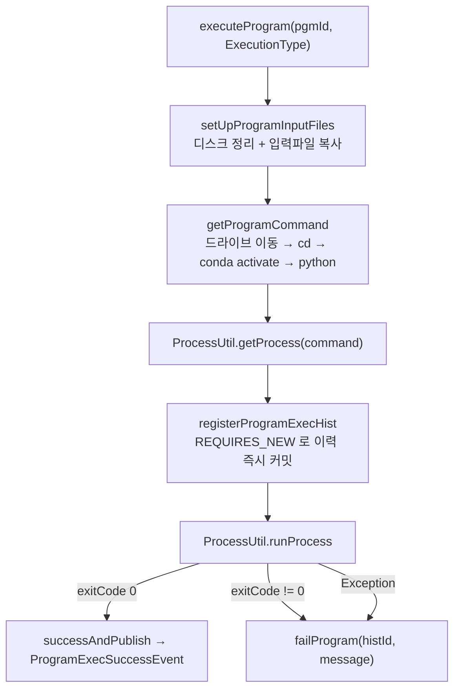

# simulation.program — 프로그램 실행과 실행이력 정리

파이썬 시뮬레이션 프로그램을 **Anaconda 가상환경에서 프로세스로 실행**하고, 그 실행이력(`pgm_exec_h`)과
결과 파일을 관리하는 패키지다. batch 모듈에서 클래스가 가장 많고 책임이 넓다.

세 가지 성격의 실행 계층이 한 패키지에 공존한다.

| 계층 | 대표 클래스 | 실행 방식 |
|---|---|---|
| **Quartz 단독 Job** | `RealtimeProgramExecuteJob` | Spring Batch 미사용. 서비스 메서드 직접 호출 |
| **Spring Batch Job** | `pgmExecHistCleanupJob` | 파티션 + chunk |
| **@Async 즉시 실행** | `ProgramExecuteAsyncFacade` | REST 요청을 `batchExecutor` 에 넘기고 즉시 응답 |

---

## 1. 패키지 구조

```
simulation/program/
├── controller/
│   ├── ProgramControlController.java       수동 실행 / 강제 종료 (비동기 위임)
│   └── ProgramExecHistController.java      이력 삭제 (단건 / 기간 배치)
├── job/
│   ├── RealtimeProgramExecuteJob.java      Quartz QuartzJobBean — 스케줄 실행
│   └── config/                             Spring Batch — 이력 일괄 정리
│       ├── ProgramExecHistCleanupJobConfig.java
│       ├── ProgramExecHistCleanupPartitioner.java   Partitioner — pgmId 목록 균등 분할
│       ├── ProgramExecHistCleanupItemReader.java    Reader — pgmId 별 커서 체인
│       └── ProgramExecHistCleanUpItemWriter.java    Writer — 파일 삭제 + 벌크 delete
├── service/
│   ├── ProgramExecuteService.java          실행 오케스트레이션 (입력파일·커맨드·프로세스)
│   ├── ProgramExecHistService.java         이력 상태 전이 (등록/성공/실패/중지)
│   └── ProgramExecuteAsyncFacade.java      @Async("batchExecutor") 래퍼
├── event/
│   ├── ProgramExecSuccessEvent.java        성공 이벤트 (record)
│   ├── ProgramExecDeletedEvent.java        삭제 이벤트 (record)
│   ├── ProgramExecHistEventPublisher.java  도메인 이벤트 발행기
│   └── ProgramExecEventHandler.java        AFTER_COMMIT 비동기 후처리
└── repository/                             ProgramRepository · ProgramExecHistRepository (+Custom)
```

---

## 2. 프로그램 실행 — Quartz 단독 Job

### 2.1 `RealtimeProgramExecuteJob`

Spring Batch 를 쓰지 않는다. **대량 처리가 아니라 외부 프로세스 1개를 띄우는 일**이라 chunk 개념이 불필요하기 때문이다.

```java
// job/RealtimeProgramExecuteJob.java
@Component
@DisallowConcurrentExecution
public class RealtimeProgramExecuteJob extends QuartzJobBean {
    @Override
    protected void executeInternal(JobExecutionContext context) throws JobExecutionException {
        String id = context.getMergedJobDataMap().getString("id");    // pgmId
        try {
            programExecuteService.executeProgram(id);                 // ExecutionType.SCHEDULED
        } catch (Exception e) {
            JobExecutionException ex = new JobExecutionException(e);
            ex.setRefireImmediately(false);                           // 즉시 재시도 금지
            throw ex;
        }
    }
}
```

- `QuartzJobBean` 을 상속하면 `JobDataMap` 값이 setter 로 자동 바인딩되지만, 여기서는 명시적으로 꺼내 쓴다
- `setRefireImmediately(false)` — 실패 시 곧바로 다시 던지지 않는다. 파이썬 프로세스 실패는 대개 재시도로 해결되지 않으므로 다음 트리거를 기다린다
- Job/Trigger 등록은 `SchedulerManagedService.reconcileProgramJobs()` 가 담당한다([schedule.md](schedule.md))

### 2.2 실행 파이프라인 — `ProgramExecuteService`



**실행 커맨드 조립** — 윈도우 Anaconda 환경 전제다.

```java
StringBuffer command = new StringBuffer(FileUtil.getTargetRootDriveName(programDirPath))  // D:
        .append(" && ").append("cd ").append(programDirPath)
        .append(" && ").append(vComp.getAnacondaActivatePath())   // Scripts/activate.bat
        .append(SPACE).append(venvPath)                           // 프로그램별 가상환경
        .append(" && ").append("python ").append(pythonFileName);
```

**이력 등록에 `REQUIRES_NEW` 를 쓰는 이유**

```java
// service/ProgramExecHistService.java
@SimulationTx(propagation = Propagation.REQUIRES_NEW)
public ProgramExecHist registerProgramExecHist(String pgmId, ExecutionType executionType, String procsId) {
    return repository.save(new ProgramExecHist(pgmId, executionType, procsId));
}
```

프로그램 실행은 수 분~수십 분이 걸릴 수 있다. 바깥 트랜잭션에 이력 저장을 묶으면
**실행이 끝날 때까지 다른 세션이 "실행 중" 상태를 볼 수 없다**. `REQUIRES_NEW` 로 별도 트랜잭션에서 즉시 커밋해
모니터링 화면이 진행 상황을 바로 볼 수 있게 한다. 성공/실패/중지 전이 메서드도 모두 같은 이유로 `REQUIRES_NEW` 다.

**디스크 용량 선점검**

```java
private void cleanupDiskFiles(String pgmId) {
    List<ProgramExecHist> list = programExecHistService.findAllByPgmIdForCheck(pgmId);   // 최근 5건
    Long totalBytes  = list.stream().mapToLong(ProgramExecHist::getRsltBytes).sum();
    Long usableBytes = getUnallocatedDiskSize();
    if (usableBytes < totalBytes) {          // 남은 용량이 부족하면
        publisher.deleteAllAndPublish(list); // 과거 이력 + 결과 디렉토리 정리
    }
}
```

실행 **전에** 용량을 확보한다. 결과 파일을 다 만든 뒤 디스크가 차서 실패하는 것보다 낫다는 판단이다.

### 2.3 이벤트 기반 후처리 — 결과 파일 수집

프로그램이 성공하면 **결과 파일을 이력 전용 디렉토리로 옮기고, SHP 결과라면 레이어까지 재생성**해야 한다.
이 무거운 후처리를 본 트랜잭션에서 떼어내기 위해 도메인 이벤트를 쓴다.

```java
// event/ProgramExecHistEventPublisher.java
public void successAndPublish(ProgramExecHist entity) {
    entity.success();
    repository.saveAndFlush(entity);
    super.publishAndClear(entity, new ProgramExecSuccessEvent(entity.getPgmId(), entity.getHistId()));
}
```

```java
// event/ProgramExecEventHandler.java
@Async("batchExecutor")
@TransactionalEventListener(phase = TransactionPhase.AFTER_COMMIT)
public void handleEvent(ProgramExecSuccessEvent event) { ... }
```

`AFTER_COMMIT` + `@Async` 조합의 의미:

| 어노테이션 | 보장하는 것 |
|---|---|
| `@TransactionalEventListener(AFTER_COMMIT)` | 이력 저장이 **실제로 커밋된 뒤에만** 후처리가 돈다. 롤백되면 파일 이동도 일어나지 않는다 |
| `@Async("batchExecutor")` | 파일 복사·레이어 재생성이 호출 스레드를 붙잡지 않는다 |

후처리가 하는 일:
1. `pgm_rslt` 정의를 조회해 기대 결과 파일 목록을 만든다
2. 하나라도 없으면 `failProgram(...)` 으로 이력을 실패 처리하고 중단한다
3. 결과 파일을 `{programBasePath}/{pgmId}/{EXEC_RESULT_DIR}/{UUID}/` 로 복사하고 `changeResultDir(...)` 로 경로·용량을 기록한다
4. SHP 결과가 있으면 레이어 디렉토리로도 복사한 뒤 `LayerManageService.migrateShpToDb(...)` 를 호출한다([layer.md](layer.md))

> `batchExecutor` 는 파티션 Slave Step 과 **같은 스레드풀**이다. 프로그램 후처리가 몰리면 배치 파티션 실행이 큐에서 대기할 수 있다.

### 2.4 REST 즉시 실행 — `ProgramExecuteAsyncFacade`

```java
@Async("batchExecutor")
public CompletableFuture<Void> executeProgram(ProgramExecuteDto dto) {
    programExecuteService.executeProgram(dto);
    return CompletableFuture.completedFuture(null);
}
```

`POST /program/execute` · `POST /program/terminate/{histId}` 는 수 분이 걸릴 수 있으므로 **HTTP 응답을 먼저 돌려주고 백그라운드에서 실행**한다.
`@Async` 는 프록시를 통해야 동작하므로 별도 파사드 클래스로 분리되어 있다(같은 클래스 내 자기호출은 프록시를 타지 않는다).

---

## 3. `pgmExecHistCleanupJob` — 사용자 지정 이력 일괄 삭제

### 3.1 목적과 위치

[partition.md](partition.md) 의 `partitionManageJob` 이 **"보관기간이 지난 달"을 통째로 지우는 정기 정리**라면,
이 Job 은 **"사용자가 고른 프로그램들의, 고른 기간"을 지우는 임의 정리**다. 둘은 목적이 다르므로 공존한다.

| | `partitionManageJob` ③단계 | `pgmExecHistCleanupJob` |
|---|---|---|
| 대상 선정 | 보관기간 초과 파티션 자동 | 사용자가 지정한 `pgmIds` + 기간 |
| 분할 축 | 물리 서브파티션 | pgmId 목록 |
| DB 행 삭제 | 안 함 (테이블째 DROP) | `deleteAllByIdInBatch` |
| gridSize / chunk | 미지정(순차) / 1000 | 12 / 500 |

### 3.2 트리거 — `POST /pgm/hists-clear`

```java
// controller/ProgramExecHistController.java
tempFilePath = Files.createTempFile(UuidCreator.getTimeOrderedEpoch() + "_" + "pgmIds", ".txt");
try (BufferedWriter writer = Files.newBufferedWriter(tempFilePath, UTF_8, CREATE, TRUNCATE_EXISTING)) {
    for (String pgmId : pgmExecHistDeleteDto.getPgmIds()) { writer.write(pgmId); writer.newLine(); }
}

JobParameters jobParameters = new JobParametersBuilder()
        .addString("tempFilePath", tempFilePath.toAbsolutePath().toString())
        .addJobParameter("startDttm", pgmExecHistDeleteDto.getStartDttm(), LocalDateTime.class)
        .addJobParameter("endDttm",   pgmExecHistDeleteDto.getEndDttm(),   LocalDateTime.class)
        .addJobParameter("fireTime",  LocalDateTime.now(),                 LocalDateTime.class)
        .toJobParameters();
jobLauncher.run(cleanJob, jobParameters);
```

목록은 임시파일, 스칼라 값(기간)은 JobParameters — [collect.md](collect.md) 의 수동 수집과 동일한 관용구다.

> `tagManualCollectJob` 과 달리 **임시파일 삭제 Tasklet 이 없다.** 이 Job 이 만든 `pgmIds` 임시파일은 OS 임시 디렉토리에 계속 쌓인다.

### 3.3 Step 구성 — `job/config/ProgramExecHistCleanupJobConfig.java`

```java
@Bean(name = "pgmExecHistCleanupMasterStep")            // :38
public Step pgmExecHistCleanupMasterStep() {
    return new StepBuilder("pgmExecHistCleanupMasterStep", jobRepository)
            .partitioner("pgmExecHistCleanupSlaveStep", partition)
            .step(pgmExecHistCleanupSlaveStep())
            .gridSize(12)                               // 수집 Job(4)보다 큼
            .taskExecutor(taskExecutor)
            .build();
}

@Bean(name = "pgmExecHistCleanupSlaveStep")             // :48
public Step pgmExecHistCleanupSlaveStep() {
    return new StepBuilder("pgmExecHistCleanupSlaveStep", jobRepository)
            .<ProgramExecHistDto, ProgramExecHistDto>chunk(500, transactionManager)
            .reader(reader)
            .writer(writer)                             // Processor 없음
            .build();
}
```

**gridSize 12 / chunk 500 의 근거**

- gridSize 를 크게 잡은 것은 작업이 **파일 I/O 바운드**이기 때문이다. CPU 를 쓰지 않고 디스크 응답을 기다리므로 병렬도를 높이면 그만큼 처리량이 는다
- chunk 를 500 으로 줄인 것은 아이템 하나당 **디렉토리 삭제 + JPA 벌크 delete** 라는 무거운 작업이 붙기 때문이다. 1000 이면 한 트랜잭션이 너무 길어져 lock 보유 시간이 늘어난다

### 3.4 Partitioner — pgmId 목록 균등 분할

```java
// job/config/ProgramExecHistCleanupPartitioner.java
@Value("#{jobParameters['tempFilePath']}")
private String tempFilePath;

public Map<String, ExecutionContext> partition(int gridSize) {
    List<String> targetIds = getPgmIds();     // 파일 라인 = pgmId 문자열
    int actualGridSize = PartitionerUtil.getActualGridSize(gridSize, targetIds.size());
    int partitionSize  = PartitionerUtil.getPartitionSize(actualGridSize, targetIds.size());
    PartitionerUtil.splitPartition(partition, actualGridSize, partitionSize, targetIds);
    return partition;
}
```

`targetList` 에 담기는 것이 DTO 가 아니라 **`List<String>`** 이라는 점만 다르고 구조는 수집 Job 과 같다.

### 3.5 Reader — pgmId 마다 커서를 새로 여는 체인

이 모듈에서 가장 복잡한 Reader 다. "pgmId 목록"을 "이력 행 스트림"으로 평탄화하되, 각 pgmId 마다 **별도 커서**를 연다.

```java
// job/config/ProgramExecHistCleanupItemReader.java
@Value("#{stepExecutionContext['targetList']}") private List<String> targetList;
@Value("#{jobParameters['startDttm']}")         private LocalDateTime startDttm;
@Value("#{jobParameters['endDttm']}")           private LocalDateTime endDttm;

private int currentPgmIndex = -1;
private JdbcCursorItemReader<ProgramExecHistDto> delegate;

@Override
public void open(ExecutionContext executionContext) {
    if (targetList == null || targetList.isEmpty()) return;
    this.currentPgmIndex = 0;
    initDelegateForCurrentPgm();
}

private void initDelegateForCurrentPgm() {
    closeCurrentDelegate();
    if (currentPgmIndex < 0 || currentPgmIndex >= targetList.size()) { delegate = null; return; }

    String pgmId = targetList.get(currentPgmIndex);
    String sql = "SELECT pgm_id, rslt_dir_id, hist_id FROM pgm_exec_h " +
                 "WHERE pgm_id = ? AND exec_strt_dttm >= ? AND exec_strt_dttm <= ?";

    this.delegate = new JdbcCursorItemReaderBuilder<ProgramExecHistDto>()
            .name("programExecHistReader_" + pgmId)
            .dataSource(dataSource).sql(sql).fetchSize(1000)
            .preparedStatementSetter(ps -> {
                ps.setString(1, pgmId);
                ps.setTimestamp(2, Timestamp.valueOf(startDttm));
                ps.setTimestamp(3, Timestamp.valueOf(endDttm));
            })
            .rowMapper((rs, rowNum) -> { ... })
            .build();
    this.delegate.open(new ExecutionContext());
}

@Override
public ProgramExecHistDto read() throws Exception {
    if (delegate == null) return null;
    while (true) {
        ProgramExecHistDto item = delegate.read();
        if (item != null) return item;                 // 한 건씩 반환
        currentPgmIndex++;                             // 현재 pgmId 소진 → 다음으로
        if (currentPgmIndex >= targetList.size()) {
            closeCurrentDelegate(); delegate = null;
            return null;                               // 전부 소진 = Step 종료
        }
        initDelegateForCurrentPgm();
    }
}
```

**설계 포인트**

- `pgm_id` 단위로 쿼리를 쪼갠 것은 `pgm_exec_h` 가 **HASH(`pgm_id`) 서브파티션**이기 때문이다. 단일 pgmId 조건이면 파티션 프루닝이 걸려 8개 중 1개만 스캔한다
- `preparedStatementSetter` 로 바인딩해 SQL injection 여지가 없다 — 테이블명을 문자열로 넣어야 했던 `partition` 패키지 Reader 와 대비된다
- **재시작 안전하지 않다.** `update()` 가 `currentPgmIndex` 를 `ExecutionContext` 에 저장하지 않아, 재시작하면 그 파티션의 첫 pgmId 부터 다시 시작한다. 삭제 작업 자체가 멱등(이미 지운 파일·행은 다시 안 걸림)이라 실무상 치명적이진 않지만 코드 주석에도 명시된 한계다

### 3.6 Writer — 파일 삭제 + 벌크 delete

```java
// job/config/ProgramExecHistCleanUpItemWriter.java
public void write(Chunk<? extends ProgramExecHistDto> chunk) throws Exception {
    Set<String> deleteHistIds = new HashSet<>();
    chunk.getItems().forEach(item -> {
        String deleteFilePath = FileUtil.getDirPath(vcomp.getProgramBasePath(), item.getPgmId(),
                                                    vcomp.getEXEC_RESULT_DIR(), item.getRsltDirId());
        FileUtil.retryDelete(deleteFilePath);      // ① 결과 디렉토리 삭제
        deleteHistIds.add(item.getHistId());
    });
    if (!deleteHistIds.isEmpty()) {
        repository.deleteAllByIdInBatch(deleteHistIds);   // ② 이력 행 일괄 삭제
    }
}
```

**순서가 중요하다.** 파일을 먼저 지우고 DB 행을 나중에 지운다.
반대로 하면 파일 삭제 중 실패했을 때 **행은 사라졌는데 파일은 남는 고아 디렉토리**가 생긴다.
지금 순서라면 파일 삭제 실패 시 행이 남아 있으므로 재실행으로 복구된다.

`deleteAllByIdInBatch` 는 JPA 벌크 delete 로, 엔티티를 로딩하지 않고 `DELETE ... WHERE id IN (...)` 한 방으로 나간다.
단 영속성 컨텍스트를 우회하므로 같은 트랜잭션에서 해당 엔티티를 다시 참조하면 안 된다.

---

## 4. 이력 상태 전이 — `ProgramExecHistService`

| 메서드 | 전이 | 비고 |
|---|---|---|
| `registerProgramExecHist` | → 실행중 | `REQUIRES_NEW`, `procsId`(OS PID) 기록 |
| `successProgram` / `successAndPublish` | 실행중 → 성공 | 이벤트 발행 동반 |
| `failProgram` | 실행중 → 실패 | `TERMINATED` 상태면 덮어쓰지 않음 |
| `stopProgram` | 실행중 → 중지 | `ProcessUtil.killProcess(procsId)` 후 전이. kill 실패 시 실패 처리 |
| `changeResultDir` | 결과 경로·용량 기록 | 후처리 이벤트에서 호출 |
| `deleteByHistId` | 삭제 | 이벤트 발행 → 결과 디렉토리 삭제 |

`failProgram` 이 `TERMINATED` 를 건너뛰는 것은 **사용자가 명시적으로 중지시킨 것**과
**프로그램이 스스로 죽은 것**을 구분해 보존하기 위해서다. kill 당한 프로세스는 0이 아닌 exit code 를 남기므로,
방어하지 않으면 사용자가 누른 "중지"가 곧바로 "실패"로 덮인다.

---

## 5. REST 엔드포인트

| Method | Path | 동작 |
|---|---|---|
| `POST` | `/program/execute` | 수동 실행 (인수 전달 가능). `@Async` 즉시 응답 |
| `POST` | `/program/terminate/{histId}` | 강제 종료. `@Async` 즉시 응답 |
| `DELETE` | `/pgm/hist/{histId}` | 단건 이력 삭제 (동기, 이벤트로 파일 정리) |
| `POST` | `/pgm/hists-clear` | 기간 일괄 삭제 → `pgmExecHistCleanupJob` |
| `POST` | `/internal/program-run/{pgmId}` | API 서버 내부 호출 — 최초 실행 (`InternalRequestController`) |

---

## 6. 관련 문서

- [README.md](README.md) — 파티셔닝 · chunk 총론
- [partition.md](partition.md) — `pgm_exec_h` 파티션 생성/DETACH/DROP, 정기 정리 Job
- [schedule.md](schedule.md) — `RealtimeProgramExecuteJob` 의 Quartz 등록·reconcile
- [layer.md](layer.md) — SHP 결과 파일의 레이어 재생성
- [common.md](common.md) — `SimulationTx` · `batchExecutor` · 도메인 이벤트 기반 클래스
