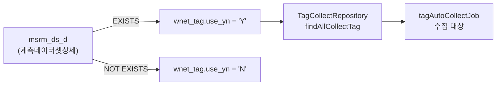

# simulation.tag — 수집대상 태그 정리

`wnet_tag`(워터넷태그정보) 테이블의 **`use_yn`(사용여부 = 수집여부) 플래그를 주기적으로 재계산**하는 패키지다.
이 모듈에서 가장 작지만(4개 클래스), **자동 수집 Job 의 대상 범위를 결정하는 상류 공정**이라는 점에서 중요하다.

- Job: `tagInfoCleanUpJob` — **Tasklet 단일 Step**. 파티션도 chunk 도 쓰지 않는다
- 주기: Quartz cron `40 5 0/2 * * ?` (2시간마다 매시 5분 40초)

---

## 1. 패키지 구조

```
simulation/tag/
├── job/
│   ├── TagInfoCleanUpRunner.java              Quartz Job → tagInfoCleanUpJob 런처
│   ├── config/TagInfoCleanUpJobConfig.java    Job / Step 정의
│   └── step/CollectTagCheckStep.java          Tasklet — UPDATE 2회 실행
└── mapper/WaternetTagMapper.java              @SimulationMapper
```

SQL 은 `resources/sqlmap/mapper/tag/WaternetTagMapper.xml` 에 있다.

---

## 2. 무엇을 하는가

계측 데이터셋(`msrm_ds_d`, 계측데이터셋상세)에 **한 번이라도 등록된 태그만 수집한다**는 규칙을 DB 상태로 반영한다.



즉 **아무 데이터셋도 참조하지 않는 태그는 수집을 멈추고, 새로 데이터셋에 편입된 태그는 수집을 시작한다.**
사용자가 데이터셋을 만들거나 지울 때마다 즉시 반영하는 대신, 2시간 주기 배치로 일괄 동기화하는 방식이다.

---

## 3. Job / Step 구성

### `job/config/TagInfoCleanUpJobConfig.java`

```java
@Bean(name = "tagInfoCleanUpJob")                      // :27
public Job tagInfoCleanUpJob() {
    return new JobBuilder("tagInfoCleanUpJob", jobRepository)
            .start(checkCollectTagStep())
            .build();
}

@Bean(name = "checkCollectTagStep")                    // :34
public Step checkCollectTagStep() {
    return new StepBuilder("checkCollectTagStep", jobRepository)
            .tasklet(checkTask, transactionManager)    // chunk 아님
            .build();
}
```

**왜 chunk 가 아닌 Tasklet 인가** — 처리 대상을 자바로 한 건씩 읽어올 필요가 전혀 없다.
"조건에 맞는 행 전부를 UPDATE" 하는 작업은 **SQL 한 문장이 가장 빠르고 안전**하다.
chunk 로 만들면 태그를 전부 읽어 Reader→Processor→Writer 를 태워야 하는데, 얻는 게 없다.

> **판단 기준** — 처리 단위가 "행"이고 진행률·부분 실패 격리가 필요하면 chunk, 집합 연산 한 방으로 끝나면 Tasklet.

### `job/step/CollectTagCheckStep.java`

```java
@StepScope @Component
public class CollectTagCheckStep implements Tasklet {
    private final WaternetTagMapper mapper;

    @Override
    public RepeatStatus execute(StepContribution contribution, ChunkContext chunkContext) throws Exception {
        mapper.updateNoneCollectableTag();   // ① 불필요 태그 → 'N'
        mapper.updateCollectableTag();       // ② 필요 태그    → 'Y'
        return RepeatStatus.FINISHED;
    }
}
```

두 UPDATE 가 **하나의 Step 트랜잭션**에 묶인다. 중간에 실패하면 함께 롤백되므로
"일부만 'N' 으로 바뀌고 'Y' 복구는 안 된" 상태가 남지 않는다.

---

## 4. SQL

`resources/sqlmap/mapper/tag/WaternetTagMapper.xml`

```sql
<!-- ① 불필요 수집대상 처리 -->
update wnet_tag a
   set use_yn = 'N'
 where not exists (select 1 from msrm_ds_d z where a.tag_sn = z.tag_sn)

<!-- ② 필요 수집대상 처리 -->
update wnet_tag a
   set use_yn = 'Y'
 where exists (select 1 from msrm_ds_d z where a.tag_sn = z.tag_sn)
```

`EXISTS` / `NOT EXISTS` 는 서로 배타적이므로 두 UPDATE 의 대상이 겹치지 않는다.
따라서 실행 순서를 바꿔도 결과는 같다(멱등).

> 조건에 이미 해당 값인 행도 UPDATE 대상에 포함된다. `and use_yn <> 'N'` 같은 조건을 덧붙이면 불필요한 쓰기와 dead tuple 을 줄일 수 있다.

---

## 5. 실행 경로

```java
// job/TagInfoCleanUpRunner.java
@Component @DisallowConcurrentExecution
public class TagInfoCleanUpRunner implements org.quartz.Job {
    public void execute(JobExecutionContext context) throws JobExecutionException {
        JobDataMap jobDataMap = context.getJobDetail().getJobDataMap();
        JobParameters jobParameters = new JobParametersBuilder()
                .addString("jobExecutor", jobDataMap.getString("jobExecutor"))   // "TAG_INFO_CLEANUP"
                .addJobParameter("fireTime", LocalDateTime.now(), LocalDateTime.class)
                .toJobParameters();
        jobLauncher.run(tagInfoCleanUpJob, jobParameters);
    }
}
```

`jobExecutor` 파라미터는 Job 안에서 **실제로 사용되지 않는다**(UPDATE 문이 감사 컬럼을 건드리지 않음).
세 Runner 가 동일한 형태를 유지하기 위한 관례적 전달이다.

스케줄 정의는 `BuiltinJobs.TAG_INFO_CLEANUP` 이며 misfire 정책은 `DO_NOTHING` 이다 —
놓친 실행을 몰아서 돌릴 이유가 없다. 2시간 뒤 정상 트리거에서 어차피 최신 상태로 맞춰진다([schedule.md](schedule.md)).

---

## 6. 관련 문서

- [collect.md](collect.md) — `use_yn = 'Y'` 를 소비하는 `tagAutoCollectJob`
- [dataset.md](dataset.md) — `msrm_ds_d` 를 생성하는 계측 데이터셋 도메인
- [schedule.md](schedule.md) — `BuiltinJobs.TAG_INFO_CLEANUP` cron 정의
- `doc/ddl/20.수집대상태그.sql` — `wnet_tag` DDL
