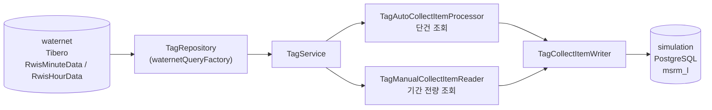

# waternet — 외부 상수도 관망 DB 연계

계측 원천 데이터가 있는 **외부 Tibero DB(`waternet`)** 를 조회하는 패키지다.
`com.hscmt.simulation` 이 아니라 **별도 루트 패키지(`com.hscmt.waternet`)** 로 분리되어 있는데,
이것은 우연이 아니라 **JPA 멀티 데이터소스 구성의 요구사항**이다.

- 읽기 전용 — 이 패키지에서 외부 DB 에 쓰는 코드는 없다
- 소비처: [collect.md](collect.md) 의 수집 Job 2종

---

## 1. 패키지 구조

```
waternet/
├── config/
│   ├── WaternetJpaConfig.java        DataSource · EntityManagerFactory · TxManager
│   ├── WaternetQueryDslConfig.java   waternetQueryFactory
│   └── WaternetTx.java               @Transactional("waternetTransactionManager") 메타 애노테이션
└── tag/
    ├── service/TagService.java       조회 파사드
    └── repository/TagRepository.java QueryDSL 조회 (215줄)
```

---

## 2. 왜 패키지가 분리되어야 하는가

`@EnableJpaRepositories` 는 **`basePackages` 로 어떤 EntityManagerFactory 를 쓸지 가른다.**
두 DataSource 의 엔티티·리포지토리가 같은 패키지 트리에 섞이면 스캔 범위가 겹쳐 매핑이 깨진다.

```java
// simulation/common/config/jpa/SimulationJpaConfig.java
@EnableJpaRepositories(
        basePackages = {"com.hscmt.simulation"},
        entityManagerFactoryRef = "simulationEntityManagerFactory",
        transactionManagerRef   = "simulationTransactionManager")

// waternet/config/WaternetJpaConfig.java
@EnableJpaRepositories(
        basePackages = {"com.hscmt.waternet"},
        entityManagerFactoryRef = "waternetEntityManagerFactory",
        transactionManagerRef   = "waternetTransactionManager")
```

`packages("com.hscmt.waternet")` 로 엔티티 스캔 범위도 같이 잘라낸다.
**패키지 경계가 곧 DB 경계**인 셈이다.

### 설정 대비표

| 항목 | `simulation` | `waternet` |
|---|---|---|
| DBMS | PostgreSQL | **Tibero** |
| 드라이버 | `P6SpyDriver` → postgresql | `P6SpyDriver` → `com.tmax.tibero.jdbc.TbDriver` |
| Hibernate dialect | 기본(PostgreSQL) | `OracleDialect` |
| `hbm2ddl.auto` | `update` | **`none`** — 외부 소유 스키마이므로 손대지 않는다 |
| `@Primary` | ✅ | ✗ |
| `@BatchDataSource` / `@QuartzDataSource` | ✅ | ✗ |
| 커넥션 풀 | max 30 | max 10 |
| `initialization-fail-timeout` | 1000 | **-1** — 기동 시 연결 실패해도 앱은 뜬다 |

`initialization-fail-timeout: -1` 이 운영상 중요하다. 외부 DB 가 내려가 있어도 배치 서버는 기동되고,
수집 Job 만 실패한다. 파티션 관리·이력 정리 같은 다른 Job 은 계속 돌 수 있다.

Tibero 드라이버는 Maven 중앙 저장소에 없어 flatDir 로 넣는다.

```groovy
// batch/build.gradle
implementation(name: "tibero6-jdbc", ext: "jar")   // libs/tibero6-jdbc.jar
```

### 트랜잭션 메타 애노테이션

```java
// waternet/config/WaternetTx.java
@Transactional(value = "waternetTransactionManager")
public @interface WaternetTx { ... }
```

`simulationTransactionManager` 가 `@Primary` 이므로, waternet 쪽 트랜잭션은 **반드시 명시**해야 한다.
`@Transactional("waternetTransactionManager")` 를 매번 쓰는 대신 짧은 애노테이션으로 감쌌다([common.md](common.md)).

> 현재 `TagService` 는 조회만 하므로 `@WaternetTx` 를 붙이지 않았다. QueryDSL `fetch()` 는 트랜잭션 없이도 동작한다.

---

## 3. `TagRepository` — 조회의 핵심

### 3.1 태그 유형에 따른 테이블 분기

원천은 **시자료 / 분자료 두 테이블**로 나뉘어 있고, 태그 유형 코드로 어느 쪽인지 판별한다.

```java
private EntityPathBase<?> getTargetTable(String tagSeCd) {
    EntityPathBase<?> q = QRwisMinuteData.rwisMinuteData;   // 기본: 분자료
    if (tagSeCd.endsWith("D")) {
        q = QRwisHourData.rwisHourData;                    // 'D' 로 끝나면 시자료
    }
    return q;
}
```

`RwisData` 를 부모로 둔 상속 구조라 두 자식이 같은 필드 집합을 갖는다.
덕분에 `EntityPathBase<?>` 로 받아 **동일한 조건 빌더와 프로젝션을 재사용**할 수 있다.

### 3.2 동적 경로 표현식

구체 Q 타입이 아니라 `EntityPathBase<?>` 를 다루므로 필드 접근도 동적으로 한다.

```java
private BooleanBuilder getCollectCondition(EntityPathBase<?> q, TagCollectDto dto) {
    BooleanBuilder builder = new BooleanBuilder();
    StringPath      logTime = Expressions.stringPath(q, "id.logTime");
    NumberPath<Long> tagsn  = Expressions.numberPath(Long.class, q, "id.tagsn");

    if (dto.getTagsn() != null && !dto.getTagsn().isEmpty())
        builder.and(tagsn.eq(Long.parseLong(dto.getTagsn())));
    if (dto.getTargetLogTime() != null && !dto.getTargetLogTime().isEmpty())
        builder.and(logTime.eq(dto.getTargetLogTime()));          // 자동 수집 — 단일 시각
    if (dto.getStartLogTime() != null && !dto.getStartLogTime().isEmpty())
        builder.and(logTime.goe(dto.getStartLogTime()));          // 수동 수집 — 기간 시작
    if (dto.getEndLogTime() != null && !dto.getEndLogTime().isEmpty())
        builder.and(logTime.loe(dto.getEndLogTime()));            // 수동 수집 — 기간 종료
    return builder;
}
```

**`TagCollectDto` 하나가 두 조회 모드를 모두 표현한다.**

| 채우는 필드 | 결과 조건 | 사용처 |
|---|---|---|
| `targetLogTime` | `logTime = ?` | `tagAutoCollectJob` — 특정 1분 |
| `startLogTime` + `endLogTime` | `logTime >= ? AND logTime <= ?` | `tagManualCollectJob` — 기간 |

`BooleanBuilder` 의 null 체크 누적 방식 덕분에 **분기 없이 한 메서드로 두 시나리오를 지원**한다.

> `logTime` 이 `String`(`yyyyMMddHHmm`) 이라 부등호 비교가 사전식 문자열 비교로 동작한다. 고정 길이 zero-padded 포맷이라 시간 순서와 일치하지만, 타입 안전성은 없다.

### 3.3 두 개의 진입 메서드

```java
public TagDataDto findTagData(TagCollectDto dto) {            // 단건 — fetchOne()
    ...
    return queryFactory.select(QProjectionUtil.toQBean(TagDataDto.class, TagDataDto.projectionFields(q)))
            .from(q).where(builder).fetchOne();
}

public List<TagDataDto> findTagDataList(TagCollectDto dto) {  // 다건 — fetch()
    ...
            .fetch();
}
```

조건 빌더와 프로젝션은 동일하고 `fetchOne()` / `fetch()` 만 다르다.
이 차이가 곧 [collect.md](collect.md) 의 **Processor 무거움 / Reader 무거움** 두 패턴의 근거다.

| 메서드 | 호출자 | 위치 |
|---|---|---|
| `findTagData` | `TagAutoCollectItemProcessor` | **Processor** — 아이템 1건당 1행 |
| `findTagDataList` | `TagManualCollectItemReader` | **Reader** — 아이템 1건당 N행 |

`findTagDataList` 는 **전량을 메모리로 가져온다**(`fetch()`). 기간이 아주 길면 OOM 위험이 있으므로,
Reader 가 커서 기반으로 스트리밍하는 편이 안전하다 — 현재는 데이터셋 조회 기간이 제한적이라는 전제에 기대고 있다.

### 3.4 그 외 조회

| 메서드 | 대상 | 용도 |
|---|---|---|
| `findAllWaternetTags` | `QIfTag` (태그 마스터) | 태그 목록 동기화 |
| `getWaternetTrendData` | 시/분 자료 | 트렌드 차트 조회 (`Map` 피벗) |

---

## 4. 조회 파사드 — `tag/service/TagService.java`

```java
@Service
@RequiredArgsConstructor
public class TagService {
    private final TagRepository repository;

    public List<TagDto> findAllWaternetTagInfos() { return repository.findAllWaternetTags(); }
    public List<Map<String, Object>> getWaternetTagTrendData(TrendSearchDto dto) { return repository.getWaternetTrendData(dto); }
    public TagDataDto findTagData(TagCollectDto dto) { return repository.findTagData(dto); }
    public List<TagDataDto> findTagDataList(TagCollectDto dto) { return repository.findTagDataList(dto); }
}
```

로직이 없는 얇은 위임 계층이다. 그래도 두는 이유는 **`simulation` 쪽 코드가 `waternet` 리포지토리를 직접 참조하지 않게** 하기 위해서다.
경계를 서비스로 고정해 두면, 나중에 외부 DB 직결을 REST 호출이나 캐시로 바꿀 때 수정 범위가 이 클래스 안에 갇힌다.

---

## 5. 데이터 흐름 요약



**읽기는 Tibero, 쓰기는 PostgreSQL** — 한 chunk 안에서 두 DB 를 오간다.
Step 트랜잭션 매니저는 `simulationTransactionManager` 하나뿐이므로 **분산 트랜잭션이 아니다**.
외부 조회는 트랜잭션 밖 읽기로 취급되고, 쓰기만 chunk 단위로 커밋된다.
그래서 Writer 의 `ON CONFLICT` upsert 멱등성이 중요하다 — 실패 후 재실행해도 중복이 생기지 않는다([collect.md](collect.md)).

---

## 6. 관련 문서

- [collect.md](collect.md) — 이 패키지를 소비하는 수집 Job 2종
- [common.md](common.md) — 멀티 DataSource 전체 구성, `@Primary` 배치
- [dataset.md](dataset.md) — 적재된 `msrm_l` 을 소비하는 쪽
